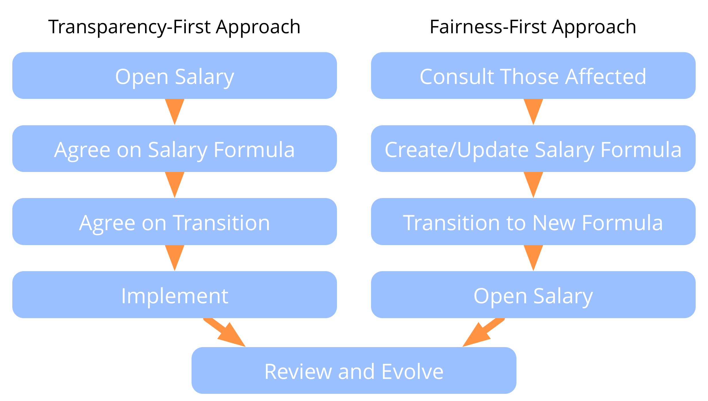

-   transparent salaries need to be fair
-   fairness has several orthogonal dimensions    
-   perception of fairness is specific to organizational context
-   consider members and relevant stakeholders (e.g. investors)
-   create a salary formula:
    -   fixed: subsistence guarantee
    -   variable: fair distribution of gains and costs
-   consider remuneration for changing roles
-   create strategy for transitioning towards new contracts and compensation agreements

### Two Ways of Opening Salaries

