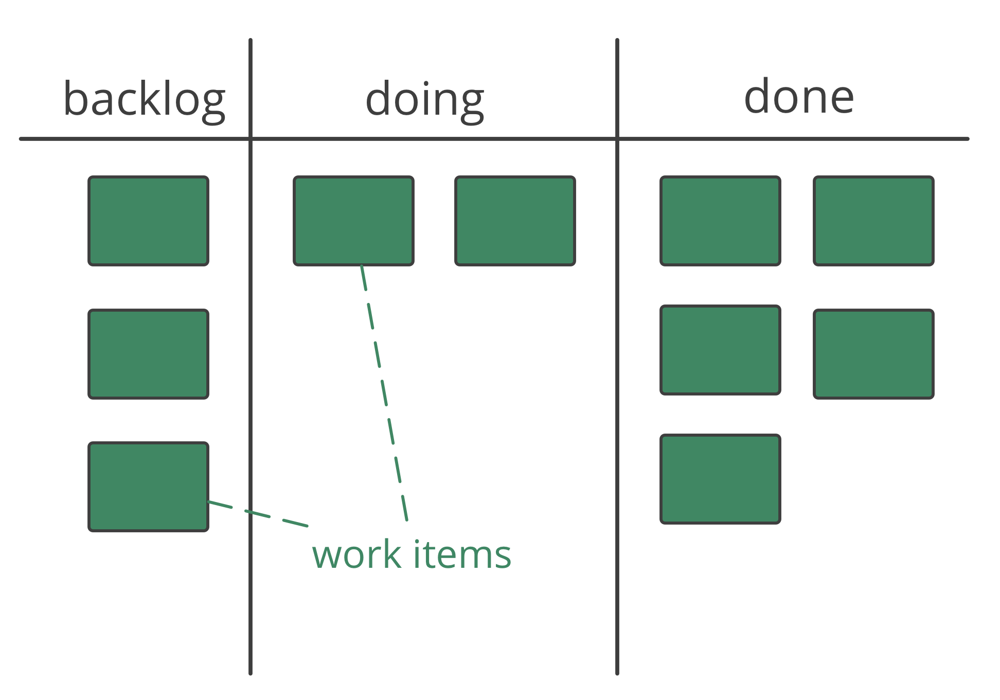
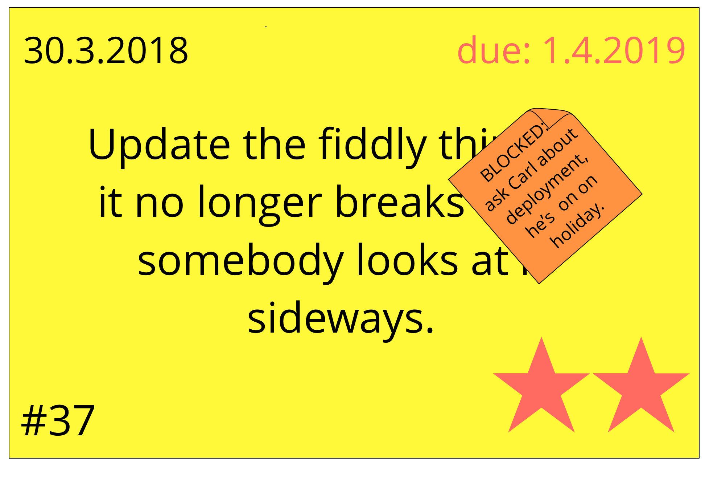

Transparency about the state of all work items currently pending, in progress or completed.

-   valuable for self-organization and pull-systems
-   system must be accessible to everyone affected
-   **analog**: post-its on a wall, or index cards, magnets and white board
-   **digital**: Trello, Kanbanery, Leankit, Jira, Google Sheets, etc.

### Things to track: 

-   **types of work items** (e.g. customer request, project tasks, reporting tasks, rework)
-   **start date** (and **due date** if necessary)
-   **priorities**
-   **stages** of work (e.g. "to do", "in progress", "review" and "done")
-   impediments/blocks
-   who is working on which items
-   agreements and expectations guiding workflow (e.g. definition of done, policy, quality standards)
-   use colors, symbols, highlights etc.

