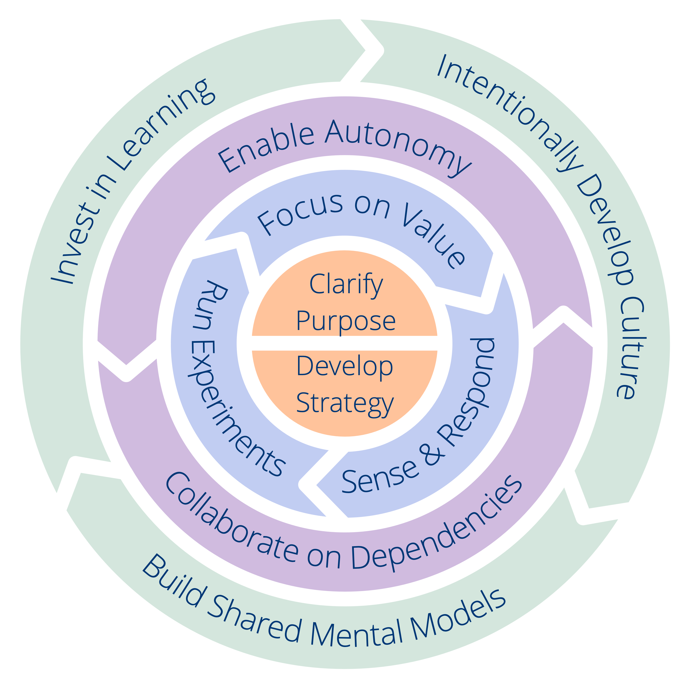

Each principle supports a specific outcome. To determine where to start in your organization or team, **take a look at the outcomes for each principle** (the text after “_so that_”) and reflect on where your greatest need lies at the moment. In any case, **check that you are clear enough on your organization’s or team’s purpose and strategy before you proceed**.

In the illustration below you can see that some of the principles are more closely related than others, which might further inform you of where to start.

For each principle we included a list of suggestions for things you can try. These suggestions are taken from the [menu of patterns contained in Sociocracy 3.0](http://patterns.sociocracy30.org). For now we only added the most essential patterns that support each principle, in future versions of this framework we will include even more patterns. 

<a href="shared-mental-models.html" title="Back to: Principle 10 – Build Shared Mental Models">◀</a> <a href="csf.html" title="Up: A Common Sense Framework for Organizations and Teams">▲</a> <a href="appendix.html" title="Read next: Appendix">▶ Read next: Appendix</a>

