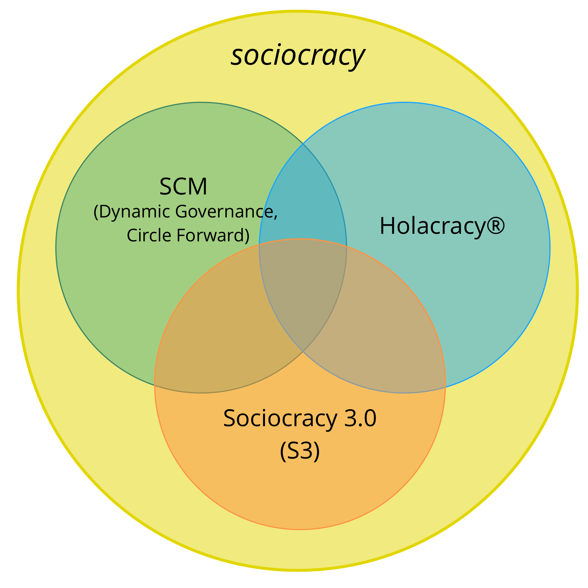

Sociocracy as a form of governance has been referred to since 1851. Subsequently it has been developed and adapted by many different people and organizations, including Gerard Endenburg, The Sociocracy Group (TSG) and Brian Robertson (HolacracyOne).

Yet, outside the Netherlands sociocracy has until recently remained largely unknown.

We love sociocracy because we see organizations and their members thrive when they use elements of it to enrich or transform what they currently do.

We also love agile, lean, Kanban, the Core Protocols, NVC, and many other ideas too. We believe that the world will be a better place as more organizations learn to pull from this cornucopia of awesome practices that are emerging into the world today, and learn to synthesize them with what they already know.

Therefore we decided to devote some of our time to develop and evolve Sociocracy, integrating it with many of these other potent ideas, to make it available and applicable to as many organizations as possible.

To this end, we recognize the value of a strong identity, a radically different way of distribution, and of adapting the *Sociocratic Circle Organization Method* to improve its applicability.

## The Name

The name "*Sociocracy 3.0*" demonstrates both respect to the lineage and a significant step forward.

It also helps avoid the perception of us misrepresenting the Sociocratic Circle Organization Method (SCM) as promoted by The Sociocracy Group (TSG), The Sociocracy Consulting Group, Sociocracy For All (SoFA), Governance Alive, and many others.

## The New Model of Distribution

*Sociocracy 3.0* employs a non-centralized model for distribution. This is a paradigm shift in the way sociocracy is brought to people and organizations, and one that many people can relate to.

We support "viral" distribution through two key strategies:

* **Sociocracy 3.0 is open:** We want to encourage growth of a vibrant ecosystem of applications and flavors of sociocracy, where people share and discuss their insights and the adaptations they are making for their specific context. To this end Sociocracy 3.0 puts emphasis on communicating the underlying principles and explicitly invites the creativity of everyone to remix, extend and adapt things to suit their needs.
* **Sociocracy 3.0 is free:** To eliminate the barrier of entry for people and organizations we provide free resources under a *Creative Commons Free Culture License* to learn, practice and teach *Sociocracy 3.0*. Everyone can use our resources without our explicit permission, even in a commercial context, or as a basis for building their own resources, as long as they share their new resources under the same license. We expect and support other organizations, consultants, coaches, learning facilitators and trainers to follow our example and release their resources too.

## The Evolution of the Sociocratic Circle Organization Method

Maybe we need to make this explicit: Sociocracy 3.0 is not targeted specifically at the existing community of people exploring the *Sociocratic Circle Organization Method*, or at The Sociocracy Group (TSG). The *Sociocratic Circle Organization Method* (SCM) is already well developed and many people appear to be mostly happy with it.

Yet from our direct experience, even for those organizations that have heard about sociocracy, there are many obstacles to actually become invested. With *Sociocracy 3.0* we actively work on addressing and eliminating what stands in the way.

### Reducing Risk and Resistance

*Sociocracy 3.0* meets organizations where they are and takes them on a journey of continuous improvement. There's no radical change or reorganization. *Sociocracy 3.0* provides a collection of independent and principle-based patterns that an organization can pull in one by one to become more effective. All patterns relate to a set of core principles, so they can easily be adapted to context.

### Shifting Focus From Aim (or Purpose) to Need

*Sociocracy 3.0* moves primary focus from vision, mission, aims or purpose, towards the source of motivation, and aligns the organization towards discovering and addressing what it needs. Organizations which are already need-driven, value driven or customer-centric, find this immediately accessible.

### Condensed to the Essentials

When looking at the norms, the *Sociocratic Circle Organization Method* may look big and scary. By focusing on the essentials only, *Sociocracy 3.0* offers a lightweight approach to adapt and build on as necessary.

This doesn't mean to say it's all easy: choosing to pull in *Sociocracy 3.0's* patterns requires an investment in learning and un-learning. This is why it's important to only pull in what you need, because there's no point to changing things if what you are doing is already good enough.

### Integration With Agile and Lean Thinking

The *Sociocratic Circle Organization Method* is an "empty" method when it comes to operations and creating a culture of close collaboration. Many organizations already implement or show preference for lean and agile thinking for operations and collaboration. We believe this is a great idea, so *Sociocracy 3.0* is designed for easy adoption into lean and agile organizations.

### A New Way to Evolve Organizational Structure

The organizational structure according to the *Sociocratic Circle Organization Method* is modeled on a hierarchy of domains. We see an increasing emergence of collaborative multi-stakeholder environments and the need for a wider variety of patterns for organizational structure.
Evolution of organizational structure happens naturally when the flow of information and influence in an organization is incrementally aligned to the flow of value. *Sociocracy 3.0* provides a variety of structural patterns that can be combined to evolve structure as required and in a flexible way.
