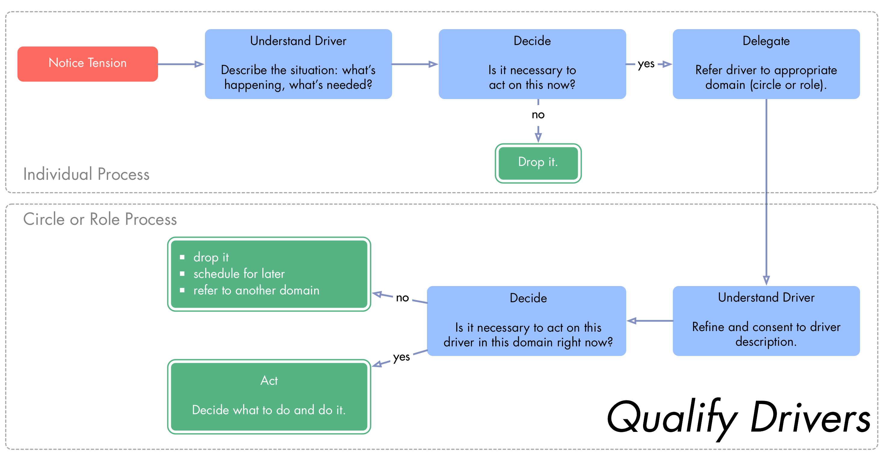

footer: Sociocracy 3.0 - Essential Patterns © 2016 by Bernhard Bockelbrink and James Priest (v2016-09-13) - evolvingcollaboration.com
slidenumbers: true
autoscale: true
theme: Plain Jane, 2

# Sociocracy 3.0 - Patterns for Agile Organizations

## Essential Patterns

#### Bernhard Bockelbrink and James Priest
#### <http://evolvingcollaboration.com/sociocracy-30/>

## The Seven Principles

**Effectiveness:** *Devote time only to what brings you closer towards achieving your objectives.*

**Consent:** *Do things only in the absence of reasons why doing so would stand in the way of (more) effectively meeting shared objectives.*

**Empiricism:** *Test all assumptions about an organization and its interactions through experiments, continuous revision and falsification.*

**Continuous Improvement:** *Respond to change in small increments, by building on and transforming what is already there, to reduce risk and resistance, and to accommodate steady empirical learning*

**Equivalence:** *People affected by decisions can influence and change them on the basis of reason to do so.*

**Transparency:** *Make all information accessible to anyone in an organization. Confidentiality requires consent.*

**Accountability:** *Respond when something is needed and be accountable for doing what you agreed to.*

---

## Consent Decision Making

* unresolved objections stop proposals becoming agreements
* can you *live with it* until the review? ➤ proposals only need to be *good enough for now, safe enough to try*

## Contract of Consent

* in the absence of objections against an agreement you support following through on the agreement as good as possible
* as soon as you become aware of an objection, or a tension with the agreement, you bring it to the circle to process it.

---

## Questions to Understand Objections ##

* Does the objection relate to this specific proposal or agreement?
* Does this objection reveal how a (proposed or existing) **agreement**...

    * ...jeopardizes the response to a driver?
    * ...is in conflict with the organization's values?
    * ...prevents or diminishes someone's contribution to responding to a driver?
    * ...can be improved significantly?

---

---

## Proposal Forming

1. **Identify** the driver 
2. **Consider**: Collect considerations as questions that reveal the scope of the issue
3. **Create**: Gather ingredients/ideas for solutions
4. **Refine**: Design a proposal from some or all of the ingredients
5. **Review**: process with consent decision making
  
---

---

### Artful Participation: Self-Assessment

* How will I support myself and others in participating more artfully? 
* Where are my interactions with others not particularly helpful or effective?
* Which are the agreements I find hard to keep or contribute to? What can I do to change that?
* What are skills that would support me in artful participation?
* What would artful participation mean in relation to...
    * ... my daily activities 
    * ...collaboration and interaction with others?
    * ...the organization? ...our customers or clients?
    * ...the wider environment?

---

## Role Description and Selection Process

* **Elements of a Role Description**
	* Date
	* Term
	* Driver
	* Responsibilities, Resources
	* Skills, Experiences, Qualities, Time
	* Schedule for Effectiveness Reviews

---

## Effectiveness Review and Development Plan

* **Steps of an Effectiveness Review**
	1. Invite people with complementing perspectives to contribute to the review, and a facilitator
	2. Collect appreciations
	3. Identify areas for improvement
		* personal development
		* updates to role description, function or driver 
	4. Co-create and consent to a development plan

---

## Meeting Evaluation

* short formats: 
    * more of/less of/start/stop/keep
    * positive/negative/suggested improvements
* long format: Ask everyone in a round to briefly contribute to any or all of the following topics: 
	* effectiveness
	* facilitation and format
	* emotional tone
	* I liked... (acknowledgments and achievements)
	* I wish... (growing edges and improvements)
	* What if... (wild ideas and radical suggestions)

**Right side: Adapt Patterns To Context**  ➤ ➤ 

