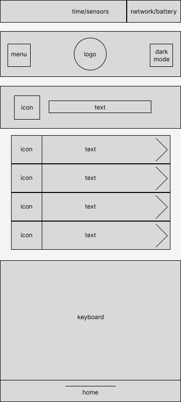

**Salutations!**

Thank you to the amazing team of people who made Sociocracy what it is today! My work would not be possible without your dedication and sacrifice. 

I believe that the map could be improved.
My goals were:

 - make a mobile device friendly UI/UX
 - make it accessible for people with disabilities
 - add a search feature to the map

I hope you like it. Please feel free to make changes to the Figma file. Contributions are always welcome here!
https://www.figma.com/community/file/1234869377785379787

## Design

## Wireframe
|page|screenshot|
|--|--|
|home| |
|menu||
|search||
