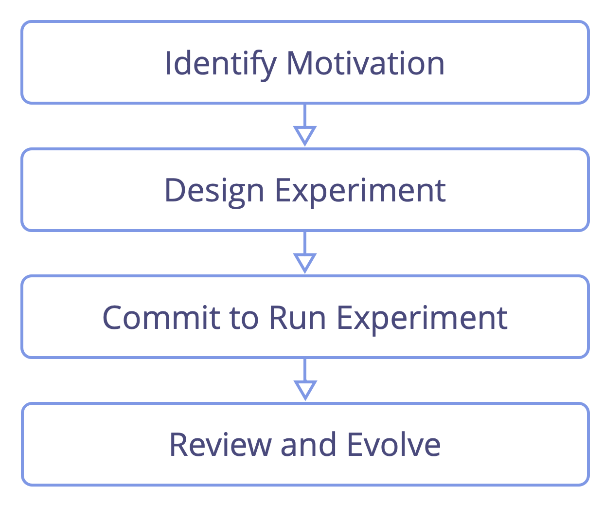
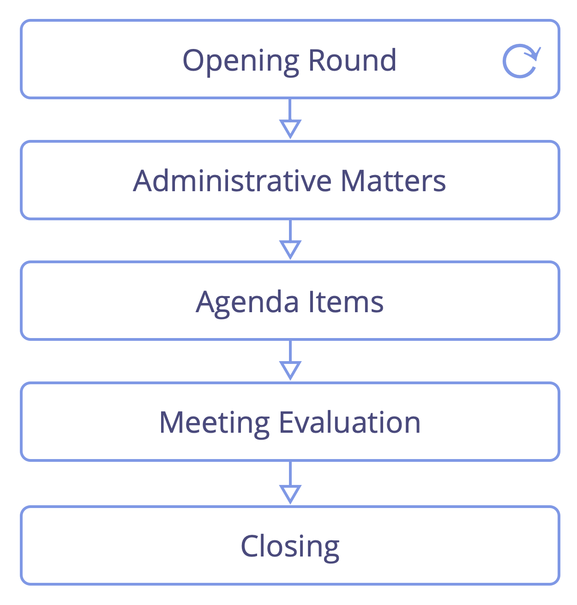
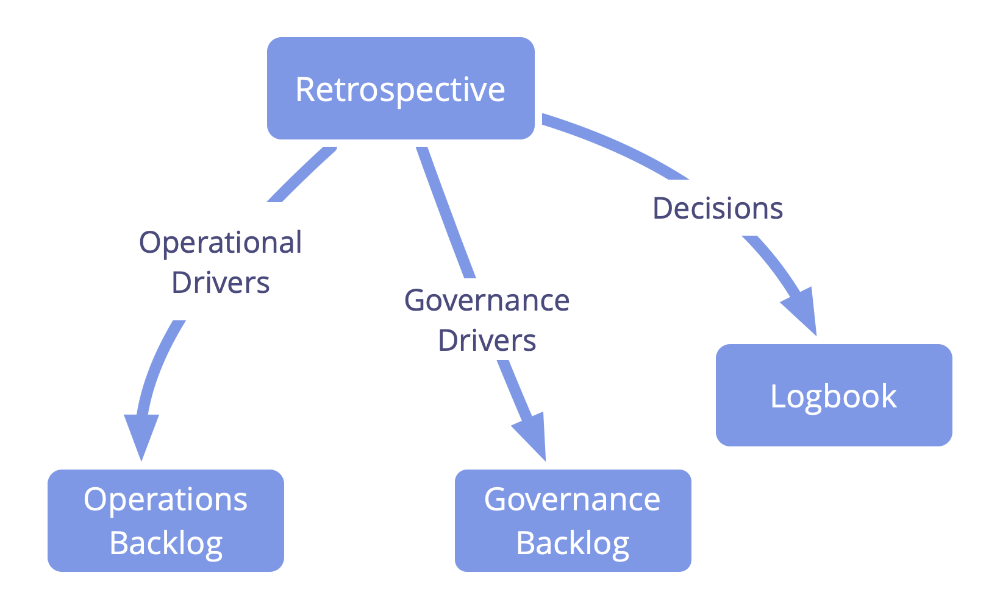
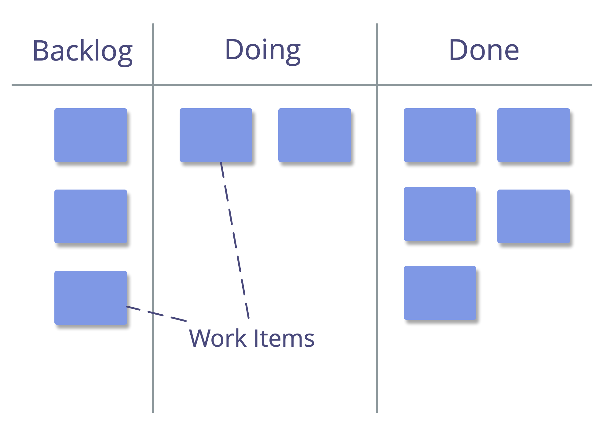
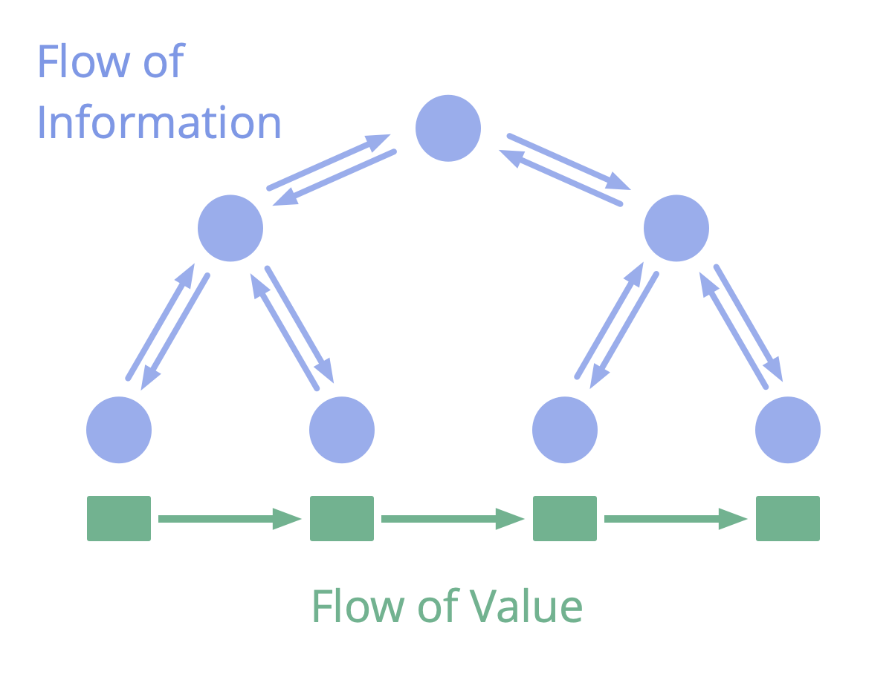
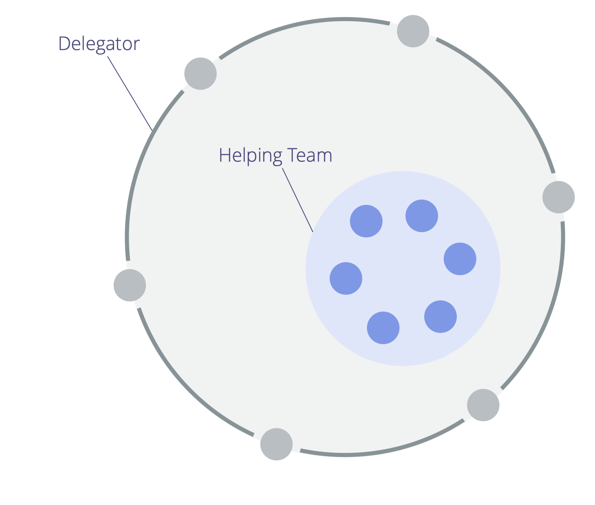
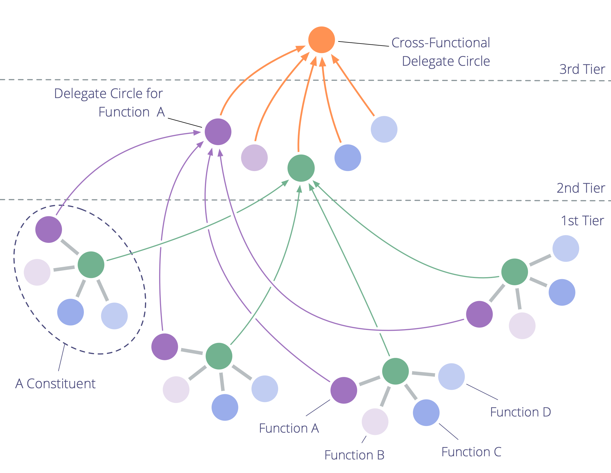

footer: ![] (img/by-sa-sm.png) Bernhard Bockelbrink and James Priest (v2017-01-28) - sociocracy30.org
slidenumbers: true
autoscale: true
theme: Plain Jane, 1

# [fit] Sociocracy 3.0

# All Patterns Explained

#### James Priest and Bernhard Bockelbrink
#### <http://sociocracy30.org>

---

# Sociocracy 3.0 - An open framework for evolving agile and resilient organizations 

### Effective Collaboration At Any Scale

* **principles-based**: a coherent guide for growing organizational integrity
* **flexible**: adaptable patterns, independent and mutually reinforcing
* **free**: licensed under a Creative Commons Free Culture License

---

---

## Influences and History

---

## Core concepts for understanding S3: 

- patterns
- the seven principles
- driver
- value 
- waste
- domain

---

## Patterns 

_A **pattern** is a template for successfully navigating a specific context._

* S3 patterns are discovered through observing many organizations as they solve problems and respond to opportunities
* S3 patterns can be evolved and adapted to suit differing contexts

---

## All Patterns are based on The Seven Principles

---

## The Seven Principles

**Effectiveness:** *Devote time only to what brings you closer towards achieving your objectives.*

**Consent:** *Do things in the absence of reasons not to.*

**Empiricism:** *Test all assumptions through experiments, continuous revision and falsification.*

---

## The Seven Principles (cont.)

**Continuous Improvement:** *Change incrementally to accommodate steady empirical learning.*

**Equivalence:** *People affected by decisions influence and change them on the basis of reasons to do so.*

**Transparency:** *All information is available to everyone in an organization, unless there is a reason for confidentiality.*

**Accountability:** *Respond when something is needed, do what you agreed to and take ownership for the course of the organization.*

---

## Drivers

A **driver** is the source of motivation for action in a specific situation (the "why"): something an individual, a group, or organization needs (or requires) in the context of achieving their objectives.

Drivers: 

* focus on the **present** (not the future or assumptions)
* precede goals, objectives, aims, mission, vision, purpose
* can change

---

##  Primary Driver, Subdriver and Superdriver

A **driver** can be understood in relation to the **domain** it defines and its relationship to other **drivers**.

The driver that defines a domain is called the **primary driver** of that domain.

The **primary driver** is the **superdriver** of all other **drivers** that arise as a consequence of people responding to it. 

A **primary driver** is itself a **subdriver** of its **superdriver**, except in the case of the organization itself, in which case it is referred to as the **organizations primary driver**.

Two **drivers** existing as a direct consequence of a response to the same **superdriver**, are described as **peer drivers**.

The prefixes **primary**, **peer**, **sub-** and **super-**, can refer to both **drivers** and **domains**.

---

### Drivers: Value and Waste

_**Value:** is the importance, worth or usefulness of something in relation to a driver._

_**Waste:** is anything not necessary for - or standing in the way of - effective response of a driver._

By adopting the concept of value and waste, many practices and ideas from **lean production** and **lean software development** can be utilized by organizations pulling in S3 patterns:

* value stream mapping
* various strategies for eliminating waste
* the Kanban Method

---

## Domain

_A **domain** is the set of subdrivers an organization may benefit from addressing when responding to a driver._

Domains need to be accounted for by people, but exist independently.

Building an organization from domains defined in relation to organizational drivers facilitates effective collaboration by creating enabling constraints with clear and coherent parameters for accountability.

---

## Domains and Accountability

* accountability applies to all agreements, including the organization itself, circles, and roles
* everyone's primary accountability is for effective collaboration in response to organizational drivers
* circles are accountable for their work, their body of agreements and their own development
* everyone in an organization is accountable for aligning action with organizational values and principles

---

---

## Pattern 1.1: Respond to Organizational Drivers

_Clarify what's happening and what's needed in relation to the organization, and respond as required._

Responses to drivers:

* action
* agreement (including creating a role, circle, team or open domain)

The response to a driver is usually an experiment that is evolved over time, 
based on learning.

---

## Review of Drivers

* Is the description of the situation still correct?
* Do we still associate the same needs with the situation?
* Is the driver still within our domain?
* Is the driver still relevant?

---

## Pattern 1.2: Qualify Organizational Drivers

Some situations might be helpful to address in the context of an organization's primary driver. Others are not within an organization's domain.

A simple way to qualify organizational drivers is by checking:

_Would responding to this driver improve - or avoid impeding - flow of value to an existing Organizational Driver? a.k.a. can it help or harm us?_

---

## Pattern 1.3: Objection

_An **objection** is a reason why doing something stands in the way of (more) effective response to a driver._

Objections contain information that reveals:

- a certain or likely consequence of harm (not considered safe enough to try)
- ways to improve proposals, decisions, existing agreements or actions

---

# Qualifying Objections

_How would doing this impede - or miss an opportunity to improve - flow of value to any organizational driver?_

Objections stop: 

* current and planned action
* people from executing on decisions
* existing agreements from continuing without being reconsidered
* proposals from becoming agreements

---

## Objection (cont.)

It's the accountability of individuals to raise objections. Those accountable for the action or (proposed) agreement they relate to, are responsible for addressing them.

Withholding objections can harm the ability of individuals, groups or the whole organization to respond to organizational drivers.

Being able to raise objections at any time means decisions only need to be *good enough for now and safe enough to try*.

---

## Understanding Objections ##

## Some Helpful Questions

* Does the objection relate to this specific proposal or agreement?
* Does this objection reveal how a (proposed or current) **action or agreement**:
    * harms response to any organizational driver?
    * can be improved right now?
    * prevents or diminishes someone's contribution towards responding to a driver?
    * is in conflict with the organization's values?
    * is considered not ‘safe enough’ to try?

---

# Concerns

A **concern** is an _opinion_ that doing something (even if already considered _good enough for now and safe enough to try_) **might** impede – or miss an opportunity to improve – flow of value to an organizational driver.

In consent decision making, concerns:

* can inform ways to further evolve agreements (including evaluation criteria and frequency of evaluation) 
* are heard if there is time or they are considered important
* are recorded in the logbook

If people believe a proposal may not be ‘safe enough to try’, they can raise concerns as objections to check with others about likelihood of harm.

---

## Pattern 1.4: Resolve Objections

---

## A way for resolving objections

* resolve objections: 
    * hear one objection
    * amend proposal 
    * ask for any objections to amendment
    * resolve objections to amendment (hear/amend/ask/resolve)
    * process next objection

---

## Pattern 1.5: Consent Decision Making

* a decision making process (often facilitated)
* invite objections, and integrate the wisdom they reveal, to evolve proposals or existing agreements
* withholding objections can harm the aims of a group or organization
* unaddressed objections prevent proposals from becoming agreements
* "can you *live with it* until the review?" ➤ proposals only need to be *good enough for now and safe enough to try*

---

## Implicit Contract of Consent

* In the absence of objections against an agreement, I intend to follow through on the agreement to the best of my ability.
* I agree to share objections as I become aware of them.

---

## Pattern 1.6: Navigate Via Tension

### Identify and accounting for organizational drivers.

**All members** bring awareness to what might help or harm the organization, and aim to account for drivers in an effective way. 

A **tension** is a personal experience: a symptom of dissonance between an individual's perception of a situation, and their expectations (or preferences). 

---

## Navigate Via Tension (cont.)

**Challenges and opportunities** for an organization are revealed as people become aware of tension they experience in relation to them.

To **discover drivers**, look behind tension and describe what's happening and what's needed. Sometimes our inquiry reveals misconceptions and the tension goes away.

Awareness of **organizational drivers** can be passed to an appropriate domain to be addressed.

---

## Navigate Via Tension (cont.)

---

## Pattern 1.7: Proposal Forming

### A (facilitated) format for co-creating a response to a driver.

* draws on the collective intelligence and diversity of perspective within a group
* involves people in co-creating agreements
* fosters accountability and sense of ownership

---
  
## Proposal Forming Process ##

- **Present and consent to driver**: _Is this driver relevant to respond to and a clear enough articulation of what's happening and what's needed_?
- **Deepen shared understanding of driver**: invite essential questions to understand more detail about the driver
- **Collect considerations** relating to possible solutions, as questions that reveal constraints and the scope of possibility (information gathering questions and generative questions)
- **Answer** any information gathering questions if possible
- **Gather ideas** as possible ingredients for a proposal
- **Design a proposal** for addressing the driver considering the creative ideas and information gathered so far. This is usually done by an individual or a smaller group.
  
---

## Template for Proposals 

---

## Pattern 1.8: Those Affected Decide

Involve everyone who will be affected by a decision, to maintain equivalence and accountability, and increase the amount of information available on the subject.

For larger groups:

* facilitate a process in several stages and create smaller groups who select delegates
* set out a virtual, asynchronous, time-boxed and staged process

Treat review and evolution of decisions accordingly.

---

## Pattern 1.9: Role Selection

### A pattern for selecting people for roles.

* People avoid expressing interest before the selection
* Nominations are made on the strength of the reason, not according to the majority
* You can nominate yourself or pass
* When checking for objections, ask the person nominated last

Objections to a nominee may be resolved in many ways, including amending the role description or by nominating someone else.

---

## Pattern 1.10: Driver Mapping

A workshop format to identify an effective response to a complex situation: organize start-ups, kick-off projects, tackle major impediments or opportunities, align organizational structure to the flow of value.

* inspired by Gojko Adzic’s Impact Mapping
* small or large groups identify and prioritize drivers, progressing quickly from concept to action in self-organizing teams.

---

## Driver Mapping (cont.)

---

## Driver Mapping: Template for Domains 

---

---

## Pattern 2.1: Ask For Help

A simple protocol for learning, skill sharing, and building connections, with respect for people's autonomy.

Ask someone, "_would you be willing to help me with ..._?"  The person asked answers with a simple "_yes_" or "_no_".

* if the request is declined, the person asking accepts the answer without negotiation or inquiry
* if the request is unclear, inquire for more information
* if you accept a request for help, support your peer in the best way you can

---

## Pattern 2.2: Peer Feedback

Invite a peer to give you some constructive feedback on: 

* performance in a role
* general feedback about your participation and collaboration
* any specific aspect you may be interested in

Considerations:

* ask peers to take some time to prepare
* invite both **appreciations** and **actionable improvement suggestions**
* inquire to better understand the feedback, and avoid to discuss or judge it
* decide for yourself what you will do with the feedback

---

## Pattern 2.3: Effectiveness Review

People support each other to learn and grow in the roles, teams and circles  they serve.

The individual holding the role - or the team or circle - initiates the process and speaks first in each step.

Invite people with complementing perspectives to contribute to the review, and a facilitator.

Improvement suggestions apply to personal development, collaboration, updates to domain description and driver statement.

---

## Effectiveness Review (cont.)

### Continuous improvement of people's ability to effectively fulfill roles or collaborate together in groups (or teams and circles)

---

## Pattern 2.4: Development Plan (for an Individual or Group)

An agreement supporting people to more effectively collaborate as a group or fulfill a role.

Contents:

- current domain description
- appreciations
- actionable improvement suggestions
- evaluation criteria
- suggested amendments to domain description and driver statement

Acting on development plans is an integral part of the strategy of people in roles, and of groups.

---

## Template for Development Plan

---

---

## Pattern 3.1: Artful Participation

A commitment to developing helpful interactions and effective collaboration. 

Participating artfully may include interrupting, objecting or breaking  agreements.

* enables **co-creation and evolution** of agreements
* is an **individual choice** and powerful when embraced by many
* building **self-accountability** and integrity develops **trust**
* individuals developing collaboration skills makes for **stronger teams**
* a culture of mutual support and close collaboration makes for **happier people**

---

## Artful participation (cont.)

An **individual commitment** to:

* actively **consider and follow-up on all agreements** made, in the best way possible, given the circumstances
* consciously **balance personal needs with those of a team** and organization as a whole 
* **developing the necessary skills** to do so
* **supporting others** in doing the same 
* bringing impediments to the attention of others if necessary

---

### Artful Participation: Self-Assessment

* How will I support myself and others in participating more artfully? 
* Where are my interactions with others unhelpful or ineffective?
* Which agreements do I find hard to keep or contribute to? What can I do to address this?
* What skills could I develop, that would support me to participate more artfully?
* What would artful participation mean in relation to:
    * my daily activities?
    * collaboration and interaction with others?
    * the organization? ...our customers or clients?
    * the wider environment?

---

## Pattern 3.2: Adopt The Seven Principles

---

## Adopt The Seven Principles (cont.)

* align collaboration with the Seven Principles
* adopting the Seven Principles reduces the number of explicit agreements required, and guides adaptation of S3 patterns to suit the organization's context
* an organization's actual values need to embrace Sociocracy 3.0 principles

---

## Pattern 3.3: Agree On Values

A pattern for intentionally shaping culture in an organization.

_A **value** is a principle that guides behavior. Values define scope for action and ethical constraints._

* each member brings their own values to an organization based on personal experiences and beliefs
* a group or organization may **choose to collectively adopt values** to guide their collaboration

--- 

## Agree On Values (cont.)

* values offer guidance to determine appropriate action, even in the absence of explicit agreements
* defining values is a **strategy** that supports effectiveness of an organization:
    * reduces potential for **misunderstanding**
    * **aligns** decision making and action
    * **attracts new members, partners and customers** who are aligned with the organization
* values are an agreement and thus subject to **regular review**

---

## Pattern 3.4: Governance Facilitator (Role)

A governance facilitator:

* is accountable for ensuring governance meetings are facilitated, stay on track and are evaluated
* is (usually) selected by a group from among it members
* familiarizes themselves with the governance backlog
* often invites others to facilitate some agenda items

---

## Governance Facilitator (cont.)

When using S3 for governance, the facilitator familiarizes themselves with the following patterns:

* rounds
* proposal forming
* consent decision making
* role selection
* evaluate meetings
* resolve objections
* effectiveness reviews

---

## Pattern 3.5: Evaluate Agreements

Regular review of agreements is an essential practice for a learning organization; continuously evolving the body of agreements, and eliminating waste:

* adapt to changing context
* integrate learning

*Is the agreement still relevant?*

*Is the agreement still good enough for now and safe enough to continue?*

*Is there a reason why **not*** to continue with this agreement?*

---

## Evaluate Agreements (cont.)

* preparation
    * schedule review
    * ensure necessary information is available

* follow-up
    * agree on next review date
    * documentation / notification
    * tracking tasks and decisions
    * effects on related agreements

---

## Evaluate Agreements (cont.)

* evaluating agreements can be as simple as checking that it is still relevant, and there is no objection to keeping the agreement as it is 
* agreements are often reviewed in *Governance Meetings* 
* sometimes it's effective to schedule a dedicated session for reviewing an agreement 
* adjust review frequency as necessary
* review earlier if required
* elements of this process can also be used by individuals to evaluate decisions they make

---

## Pattern 3.6: Breaking Agreements

* is sometimes **necessary**...
* ...but may come at a **cost** to the community
* be accountable!
    * **clean up** disturbances
    * **follow up** ASAP with those affected or accountable
    * **initiate changes** instead of repeatedly breaking the same agreement

---

## Pattern 3.7: Contracting And Accountability

When entering into formal or informal agreements with others:

* ensure all parties understand what's expected of them and intend to keep to the agreement
* verify the agreement is beneficial to all parties, and that expectations are realistic

Be accountable for breaking agreements. 

---

## Contracting And Accountability (cont.)

To preserve organizational culture, maintain self-accountability and help new members of an organization or circle have a smooth start:

- define expectations for new members (both cultural fit and the skills required)
- align contract with both organizational culture and legal requirements
- consider a probationary period
- have clear procedures for breaches of contract

---

## Pattern 3.8: Transparent Salary

* transparent salaries need to be fair
* fairness has several orthogonal dimensions    
* perception of fairness is specific to organizational context
* consider members and relevant stakeholders (e.g. investors)
* create a salary formula:
    * fixed: subsistence guarantee
    * variable: fair distribution of gains and costs
* consider remuneration for changing roles
* create strategy for transitioning towards new contracts and compensation agreements

---

## Two Ways of Opening Salaries

---

## Pattern 3.9: Support Role

### Apply the role pattern to external contractors
    
* clarify and describe driver for the role
* create domain description
* implement a selection process
* limit term of the contract
* build in regular effectiveness reviews

Support roles may be operational only, and external contractors consent to account for their role.

---

## Pattern 3.10: Bylaws

Secure S3 principles and patterns in your bylaws as needed to protect **legal integrity** and **organizational culture**

Consider:
    
* consent and equivalence in decision making
* selection process for leadership roles
* organizational structure, values and principles
* influence of owners or shareholders
* sharing gains and costs

---

---

## Pattern 4.1: Nested Domains

Understanding an organization in terms of nested domains to account for - and areas where the people responding have semi-autonomy to decide - facilitates more effective collaboration.

When defining a domain in relation to an organizational driver, consider responsibilities, the resources and skills required, necessary collaboration and exchange with other domains, and other constraints to people's autonomy to account for that domain.

---

## Pattern 4.2: Circle

  

_A **circle** is a semi-autonomous, self-governing, and self-organizing group of people collaborating to respond to a driver._

A circle:

* may be permanent or temporary
* is accountable for its own development

---

## Circle (cont.)

* **semi-autonomous and self-organizing**: 
    * a circle acts within the constraints of the surrounding organization
    * each circle responds to a primary driver, can create value independently, and organizes its day-to-day-work
* **self-governing**:
    * leads in creating its strategy and agreements

---

## Pattern 4.3: Role

_A **role** is a set of constraints for how an individual can account for a domain._

People selected into roles are autonomous to decide and act within these constraints.

- people can be in more than one role
- selection is by consent and for a limited term
- people in roles lead in creating strategy for how to account for the role's domain, checking for objections with the parent circle
- peers support one another to develop in the roles they fulfill

---

## Role: one way to account for a domain

---

## Pattern 4.4: Linking

### Facilitates flow of information and influence between two circles (or teams).

A circle (or team) selects one of its members to represent their interests in the governance decision making of another group.

---

## Pattern 4.5: Double Linking

### Facilitates **two-way** flow of information and influence between two circles (or teams).

Two interdependent circles (or teams) each select one of their members to represent their interests in the governance decision making of the other group.

* creates equivalence between two groups
* can be used to draw out valuable information in hierarchical structures

---

## Pattern 4.6: Representative

Representatives (a.k.a. links):

* stand for the interests of a circle (or team) in another circle
* are selected for a limited term
* participate as full members in the **governance decision making** of the circle they are delegated to, and can:
    * raise items for the agenda
    * participate in forming proposals
    * object to agreements and proposals (when there is reason to do so)

---

---

## Pattern 5.1: Adapt Patterns To Context

* adapting and evolving S3 patterns is a hypothesis-driven process
* ensure everyone affected by adaptation:
    - understands why it is necessary to adapt the pattern
    - is present or represented when doing so
* use S3 principles as a guide for adaptation
* run experiments with adaptation for long enough to learn about benefits and potential pitfalls
* consider sharing valuable adaptations with the S3 community

---

## Pattern 5.2: Create a Pull-System For Organizational Change

Change things when there is value in doing so.

Create an environment that invites and enables members of the organization to drive change:

* bring in patterns that solve current and important problems
  * don't break what's already working!
  * meet everyone where they are…
  * …and let them choose their own pace
* consider making all change voluntary!

---

## Pattern 5.3: Be The Change

Lead by example.

Behave and act in the ways you would like others to behave and act.

---

## Pattern 5.4: Invite Change

A way for individuals to initiate and facilitate change.

* be the change you want to see
* use and adapt S3 patterns to address drivers when it's helpful to do so
* tell the story about how and why you are using patterns from S3, including documenting outcomes, successes and failures
* invite others to experiment with you

---

## Pattern 5.5: Open S3 Adoption

* identify the driver for pulling in S3 patterns
* schedule regular open space events:
    * invite all members to create and run experiments
    * define constraints for experiments: e.g. S3 principles
    * review and learn from experimentation in the next open space
    * repeat

---

## Pattern 5.6: Continuous Improvement Of Work Process With S3

### To reveal drivers and establish a metrics-based pull-system for organizational change.

* introduce the principle of consent and _Navigate Via Tension_ to evolve work process in one team
* consider selecting a facilitator and agreeing on values
* trigger continuous improvement (e.g through Kanban)
* team members pull in S3 patterns as required
* expand the scope of the experiment iteratively
* intentionally look out for impediments  

---

## Waste And Continuous Improvement

**Waste** _is anything not necessary for - or standing in the way of - effective response to a driver._

* waste exists in various forms and on different levels of abstraction (tasks, processes, organizational structure, mental models...)
* establishing a process for ongoing elimination of waste enables natural evolution of an organization towards greater effectiveness
* adaptation to changing context is built into the process

---

---

## S3 promotes a hypothesis-driven approach to decision making

---

## Agreement Life-Cycle

---

## Pattern 6.1: Agreement

_An **agreement** is an agreed upon guideline, process or protocol designed to guide the flow of value._

* agreements are created in response to drivers 
* agreements are the **accountability of the people** that make them
* agreements are **regularly reviewed**

---

## Template for Agreements

---

## Pattern 6.2: Strategy

_A **strategy** is a high level approach towards creating value within a domain._

* an organization, circle or a person in a role can develop their own strategy
* a strategy often includes a description of the intended outcome (a.k.a. "vision")
* for roles and circles it's often helpful to invite peers, or a superset circle, to look over a strategy and offer any objections and improvement suggestions
* strategy is regularly reviewed and updated as necessary (*pivot or persevere*)

---

## Strategy (cont.)

### Strategies are implemented and refined through experimentation and learning. 

---

## Pattern 6.3: Domain Description 

A domain description is used as a circle, open location and role description too. It contains:

* a description of the domain: primary driver and key subdrivers (key responsibilities)
* details of any constraints in relation to people accounting for the domain:
    - preferred/required skills, qualities, experience
    - resources, budget, time, privileges
    - evaluation criteria and frequency
    - term (for a role)
* (previous versions)

---

## Pattern 6.4: Intended Outcome

* a concise description of the expected result of an agreement, action, project or strategy
* specific *Evaluation Criteria* and metrics can be helpful for reviewing the actual outcome

---

## Pattern 6.5: Describing Deliverables

A **deliverable** is something which is provided as a result of an agreement in response to a driver. Deliverables include products, raw materials, services, experiences and transformation.

In the context of an agreement, clearly describing deliverables supports shared understanding:

* include the necessary amount of detail
* reference other documents when helpful or necessary

---

## Describing Deliverables (cont.)

Explicitly defining deliverables can be useful for improving: 

* organizational strategy
* circle strategy
* development plans
* domain descriptions
* any other agreement (e.g. business goals, process policy, customer communication)

---

## Pattern 6.6: Evaluation Criteria

Defining evaluation criteria can help to understand whether or not an agreement has the desired effect. 

* go for **simple and unambiguous** criteria and document them (to avoid discussion when reviewing your agreements)
* define **actionable metrics** to continuously track effects and spot deviations from intended outcomes

---

## Pattern 6.7: Logbook

A logbook is a (digital) system to store all information relevant for running an organization and its teams. The logbook is accessible to all members of an organization, and information is kept confidential only when there is good reason to do so.

Common platforms for logbooks are Wikis (e.g. Dokuwiki or MediaWiki), Content Management Systems (e.g. Wordpress), Google Drive, Evernote or Trello etc.

---

## Logbook Contents

* Organization: 
    * primary driver, strategy and organizational values
    * organizational structure (domains and connections)
    * agreements 

* Circle: 
    * circle description and strategy
    * agreements (including subset circles' descriptions and strategies, role descriptions, development plans)
    * backlogs and other information relating to a circle's work and decision making

---

## Logbook Contents (cont.)

* Personal logbooks
    * role descriptions, strategies and development plans
    * operational backlog

---

## Pattern 6.8: Logbook Keeper (Role)

The logbook keeper is accountable for maintaining a circle's logbook by: 

* recording details of agreements, role descriptions, selections, evaluation dates, minutes of meetings etc.
* organizing relevant information and improving the system when valuable
* keeping records up to date
* ensuring accessibility to everyone in the circle (and in the wider organization as agreed)
• attending to all technical aspects of logbook keeping

---

---

## Pattern 7.1: Governance Meeting

Groups of people meet at regular intervals to create and evolve agreements relating to drivers they are accountable for.

A governance meeting is usually:

* facilitated 
* prepared in advance 
* time-boxed for a duration of 90-120 minutes
* scheduled every 4 weeks

---

## A typical governance meeting includes: 

* opening round: attune with each other and to the driver of the group
* administrative matters 
    * consent to last minutes, date for next meeting, etc.
    * check for last-minute agenda items and consent to agenda
* agenda items 
* meeting evaluation: reflect on your interactions, celebrate successes and share suggestions for improvement
* closing

---

## Typical agenda items include

* any short reports 
* evaluation of existing agreements due review
* new drivers requiring decisions to be made, including: 
    * understanding and agreeing on situations that require attention 
    * forming proposals and making agreements 
    * creating and defining new roles and teams 
    * reviewing existing roles and teams 
    * selecting people to roles 

---

## Pattern 7.2: Retrospective

Building in continuous improvement of work process through reflection and learning from past experience.

* output: changes to work process, new tasks, on-the-fly agreements, and drivers requiring an agreement
* facilitated meeting (~1hr)
* regular intervals (1-4 weeks)
* adapt to situation and context

---

## Output of a Retrospective 

---

## Five Phases of a Retrospective Meeting ##

1. Set the stage 
2. Gather data
3. Generate insights
4. Decide what to do
5. Close the retrospective

Many different activities for each phase can be found at [plans-for-retrospectives.com](http://www.plans-for-retrospectives.com/)

---

## Pattern 7.3: Daily Standup

**Coordinate work, facilitate learning, improve productivity and effectiveness.**

* ~15 min
* every day at the same time
* circle or team gathers around a visible project management board/tool
* coordination of daily work
* addressing impediments/blocks
* adaptation of existing agreements or creation of new agreements on the spot

---

## Pattern 7.4: Planning And Review Meetings

* planning and review meetings happen at regular intervals (1-4 weeks)
* planning meeting: 
    - select and estimate work items for iteration
* review meeting: 
    - review completed work items
    - decide on re-work and changes for next iteration

---

## Pattern 7.5: Coordination Meeting

Meet on a regular basis (usually weekly) for reporting on and coordinating work.

* facilitate the meeting, and use rounds instead of discussions where valuable
* if possible, compile the agenda before the meeting
    - include any prerequisites for attendees to prepare
    - further items may come up when hearing status reports

---

## Coordination Meeting

* Status Reports: 
    - circle metrics (if any)
    - projects and tasks
* Agenda Items: 
    - sharing of information
    - add or update tasks or projects
    - propose new or updated agreements

---

---

## Pattern 8.1: Rounds

 

A group facilitation technique to maintain equivalence.

1. Pick a random person to start
    * begin each round with a different person to maintain equivalence
2. Go around the circle giving everyone the chance to speak

There are a number of ways that experienced groups can fast track certain rounds.

---

## Pattern 8.2: Facilitate Meetings

Choose someone to facilitate a meeting. Even an inexperienced facilitator can help to focus a meeting and make a positive difference.

* prepare an agenda of topics
* select a facilitator who:
    * facilitates a suitable activity or format for each topic
    * holds the space, keeps the time and navigates the agenda during the meeting
    * facilitates an evaluation of the meeting at the end

---

## Pattern 8.3: Evaluate Meetings

Take time for learning at the end of each meeting or workshop.
 Reflect on interactions, celebrate successes and share suggestions for improvement.

* before the closing round
* reserve 5 minutes for 1 hour, and 15 minutes for a full-day workshop
* record learning and review before the next meeting
* short formats: 
    * more of/less of/start/stop/keep
    * positive/critical/suggested improvements

---

## Evaluate Meetings: Long Format

Ask everyone in a round to reflect on any or all of the following topics in a brief sharing: 

* effectiveness and format
* facilitation and participation
* emotional tone
* appreciations and achievements (I liked...)
* growing edges and improvement suggestions (I wish...)
* wild ideas and radical suggestions (What if...)

---

## Pattern 8.4: Meeting Host (Role)

The meeting host is accountable for preparation and follow-up of meetings, workshops or other events. 

The role may be assigned temporarily (i.e. for one specific event) or for a duration of time.

---

## Meeting Host: Responsibilities

* preparation
    - identify goals and deliverables
    - prepare and distribute agenda and schedule
    - estimate required time
    - identify and invite participants
    - schedule the meeting/workshop
    - book location (and transportation if required)
    - set up the space, provide required materials and information
    - ensure selection of a facilitator and a notetaker to record minutes, if appropriate
* follow-up
    - clean up location, return keys etc.
    - ensure minutes are distributed

---

## Pattern 8.5: Governance Backlog

A governance backlog is a visible, prioritized list of items (drivers) that require (or may benefit from) a group decision.

* decisions to make
* proposals to create and consider
* agreements for review
* selecting people for roles
* upcoming effectiveness reviews

---

---

## Pattern 9.1: Backlog

A backlog (to-do-list) is a visible list of (often prioritized) uncompleted work items (drivers) that need to be addressed.

Types of backlog include:

* operations backlog
* sprint backlog
* product backlog
* impediments backlog

---

##  Backlog (cont.)

* **Implementation**
    - **analog backlog**: sticky notes on a wall, or index cards, magnets and whiteboard
    - **digital backlog**: e.g. Google Sheets, Trello, Kanban Flow, Jira

---

## Elements of a (prioritized) backlog 

* a **short description** or a driver statement
* a **unique reference number** (or link) for each work item
* (the **order of work items**)
* **dependencies** to other work items or projects
* **due date** (if necessary)
* (optional) a measure for **value** 
* (optional) a measure for **investment** (often an estimate of time or complexity)

---

## Pattern 9.2: Prioritize Backlogs

Order **all uncompleted work items** with the most important items first:

* work items are pulled from the top whenever there is new capacity
* no two items can be of equal importance, meaning it is necessary to agree on priorities and make tough choices
* **Benefits**
    - focus on most important items
    - shared understanding of priorities enables more effective collaboration

---

## Pattern 9.3: Visualize Work

Transparency about the state of all work items currently pending, in progress or completed.

* valuable for self-organization and pull-systems
* system must be accessible to everyone affected
* **analog**: post-its on a wall, or index cards, magnets and white board
* **digital**: Trello, Kanbanery, Leankit, Jira, Google Sheets, etc.

---

## Things to track: 

* **types of work items** (e.g. customer request, project tasks, reporting tasks, rework)
* **start date** (and **due date** if necessary)
* **priorities**
* **stages** of work (e.g. "to do", "in progress", "review" and "done")
* impediments/blocks
* who is working on which items
* agreements and expectations guiding workflow (e.g. definition of done, policy, quality standards)
* use colors, symbols, highlights etc.

---

## Pattern 9.4: Pull-System For Work

* people pull in new items when they have capacity (instead of work being pushed at them)
* prioritize available work items to ensure that important items are worked on first
* prevents overloading the system, especially when work in progress (WIP) per person is limited 

---

## Pattern 9.5: Limit Work in Progress

Limit the number of work items in any stage of your work process. 

Work in Progress includes:

* number of items in a backlog
* concurrent projects or tasks for teams or individuals
* products in a portfolio

When an action would exceed an agreed upon limit of work items in progress, this needs to be brought up with the group before continuing.

---

## Pattern 9.6: Align Flow

* in an effective organization, **flow of information and influence supports the continuous flow of value**
* alignment is achieved and maintained through the continuous improvement of agreements (and individual's decisions)

---

### Flow of Value ###

* flow of value is guided by (explicit and implicit) agreements and assumptions
* work in progress is regarded as waste because it ties up resources
* continuous flow of value reduces the potential for accumulation of waste
    * it also makes for shorter feedback loops and amplifies learning

---

## Pattern 9.7: Coordinator (Role)

A person in the role of a coordinator is accountable for **coordinating a group's operations** and is **selected for a limited term.**

- the coordinator may be selected by the group itself, or by a superset circle
- the coordinator role is an optional pattern for coordination work within a domain
- coordinators may collaborate to synchronize work across multiple domains

---

---

## Organizational Structure

Organizational structure is the actual arrangement of domains and their connections. It reflects where power to influence is located, and the channels through which information and influence flow.

An effective organizational structure:

* supports flow of value
* enables collaboration
* ensures information is available to those who need it
* distributes power to influence as required
* evolves continuously to adapt to changing context

---

## Organizational Structure (cont.)

The basic building blocks for organizational structure are interdependent, connected domains.

Domains can be linked in a hierarchy or a **heterarchy** (a.k.a. complex adaptive system, or network), where different functional structures co-exist.

---

## Structural Patterns

Sociocracy 3.0 describes a variety of patterns to grow organizational structure.

* patterns apply to different layers of abstraction
* different structural patterns serve different drivers
* structural patterns can be adapted and combined as needed
* more patterns are out there and will be discovered

---

## Pattern 10.1: Helping Team

A group of people with the mandate to execute on requirements defined by a circle in response to a driver.

* a way for a circle to expand its capacity
* may be self-organizing or guided by a coordinator chosen by the parent circle
* is governed by the parent circle

members of the helping circle:

* can object to decisions made by the parent circle that affect them
* can add items to the governance backlog of the parent circle
* may be invited to select a representative to participate in the governance decision making of the parent circle

---

## Pattern 10.2: Service Circle

### A pattern for outsourcing services required by two or more domains.

A service circle can be populated by members of the domains it serves, and/or by other people too.

---

## Pattern 10.3: Delegate Circle

### A pattern for deciding how to address drivers affecting multiple domains.

Decisions of a delegate circle are acted upon in the various domains it serves.

Each circle selects one or more members as representative(s) to a delegate circle.

Delegate circles provide a way of steering organizations from the ground up, and bring a diversity of perspective to decision making.

---

## Pattern 10.4: Coordination Circle

A coordination circle coordinates work across multiple domains.

Coordination circles may be accountable for all aspects of execution within an organization or only for coordination of work across or within a specific subdomain.

A coordination circle is populated by coordinators of the various circles, along with representatives of those circles in the governance decision making.

---

## Pattern 10.5: Peach Organization

A pattern for decentralized organizations to deliver value in complex and competitive environments.

* circles on the periphery deliver value in direct exchange with the outside world (customers, partners, communities, municipalities etc.) 
* the center provides internal services to support the organization
* periphery stewards the monetary resources and steers the organization

---

## Pattern 10.6: Double-Linked Hierarchy

### A pattern for bringing equivalence to governance in a typical organizational hierarchy.

* power in governance decision making rests with self-governing circles (not individuals)
* circles select a member to represent their interests in governance decision making in the next higher (superset) circle
* functional hierarchy is still possible if valuable

---

## Pattern 10.7: Open Systems

An organization (or it's various sub-domains) can benefit from intentionally communicating with and learning from others.

An organization is an interdependent system that benefits from consciously inviting **information and influence** from people who can assist with making decisions and experimenting to learn.

---

## Open Systems (cont.)

* **External experts** can offer an outside perspective and bring knowledge, understanding and skills
* **Representatives of affected parties** can inform and influence decision making in ways that benefit overall objectives (➤ Those Affected Decide)

---

## Pattern 10.8: Backbone Organization

### A pattern for multi-stakeholder collaboration and alignment towards a shared driver.

* improves potential for equivalence between various entities
* increases cross-departmental/organizational alignment
* supports multi-agency collaboration between departments/organizations with different primary motives, or that are in conflict
* suitable for one-off projects, or ongoing collaboration

---

## Pattern 10.9: Fractal Organization

A pattern for multiple organizations (or domains) with a common driver to share learning and if valuable, coordinate and align action.

* a way to organize, align and steer from the ground up, while preserving autonomy and agency of the various entities involved
* a structure to facilitate innovation and exchange of learning throughout a large community on an 'as needed' basis

---

## Links

**S3 website**: [http://sociocracy30.org](http://sociocracy30.org)

Follow us on **twitter**: [@sociocracy30](http://twitter.com/@sociocracy30)

---

# License

This work by Bernhard Bockelbrink and James Priest is licensed under the Creative Commons Attribution-ShareAlike 4.0 International License. To view a copy of this license, visit 
[http://creativecommons.org/licenses/by-sa/4.0/](http://creativecommons.org/licenses/by-sa/4.0/).

The latest version of this document is available at 
<http://sociocracy30.org>

---

**James Priest** serves internationally, providing organizational development consultancy, learning facilitation, mentoring and conflict resolution for people wishing to evolve collaborative, adaptive organizations at scale.

[thriveincollaboration.com](http://thriveincollaboration.com)  -- [james@thriveincollaboration.com](mailto:james@thriveincollaboration.com)

**Bernhard Bockelbrink** is an agile coach, trainer and consultant supporting individuals, teams and organizations in navigating complex challenges and developing a culture of effective, conscious and joyful collaboration.

[evolvingcollaboration.com](http://evolvingcollaboration.com) -- [bernhard.bockelbrink@gmail.com](mailto:bernhard.bockelbrink@gmail.com)
