footer: Sociocracy 3.0 - Patterns for Agile Organizations © 2016 by Bernhard Bockelbrink and James Priest (v2016-11-21) - evolvingcollaboration.com
slidenumbers: true
autoscale: true
theme: Plain Jane, 2

# [fit] Sociocracy 3.0

# All Patterns Explained

#### Bernhard Bockelbrink and James Priest
#### <http://sociocracy30.org>

---

## Sociocracy 3.0 is a Framework of Patterns for Collaboration in Agile Organizations

_A **pattern** is a template for successfully navigating a specific context._

* patterns are discovered through observing many organizations as they solve problems and respond to opportunities
* patterns can be evolved and adapted to suit differing contexts

---

## Influences and History

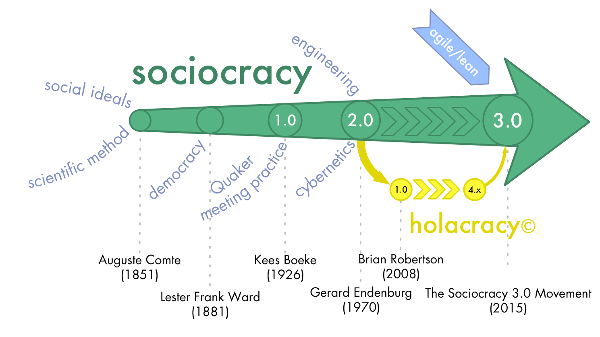

---

## All Patterns are based on The Seven Principles

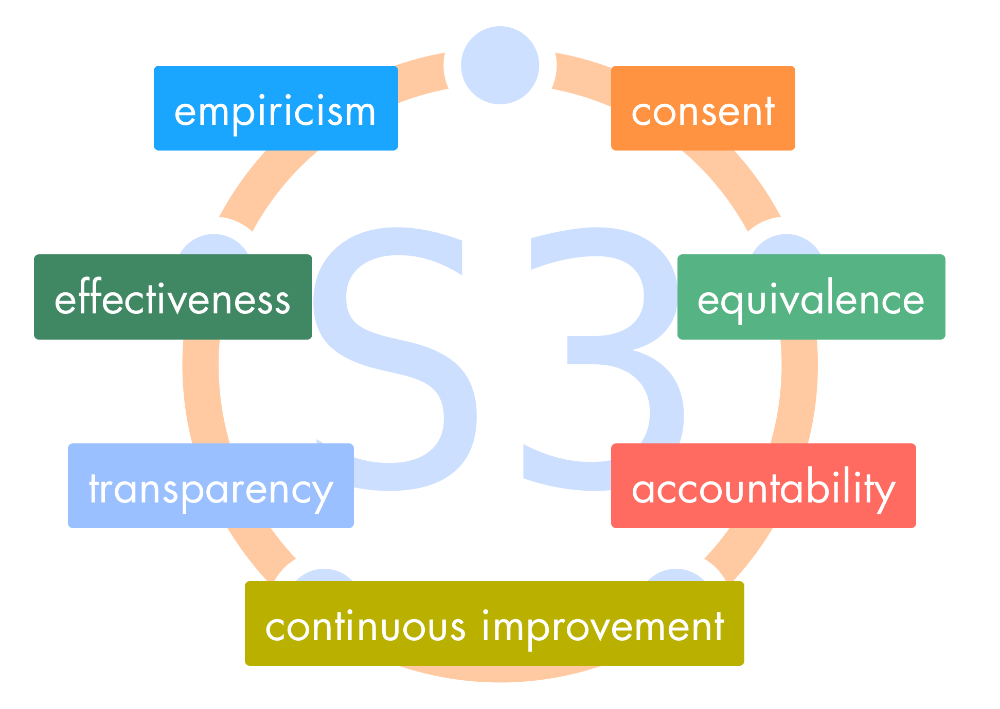

---

## The Seven Principles

**Effectiveness:** *Devote time only to what brings you closer towards achieving your objectives.*

**Consent:** *Do things in the absence of reasons not to.*

**Empiricism:** *Test all assumptions through experiments, continuous revision and falsification.*

---

## The Seven Principles (cont.)

**Continuous Improvement:** *Change incrementally to accommodate steady empirical learning.*

**Equivalence:** *People affected by decisions can influence and change them on the basis of reasons to do so.*

**Transparency:** *All information is availble to everyone in an organization, unless there's a reason for confidentiality.*

**Accountability:** *Respond when something is needed and be accountable for doing what you agreed to.*

---

## 65 Patterns

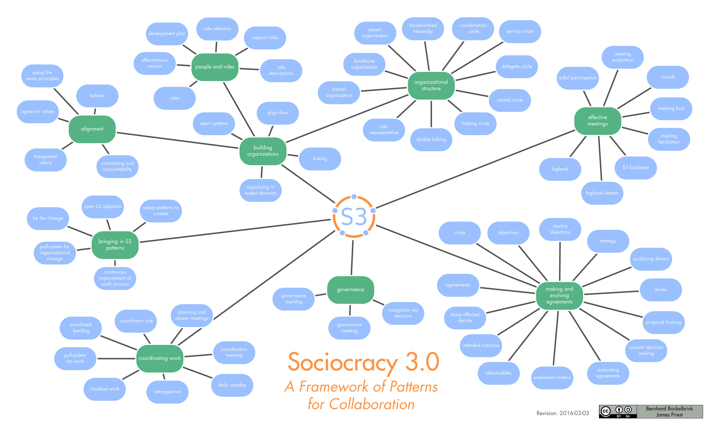

---

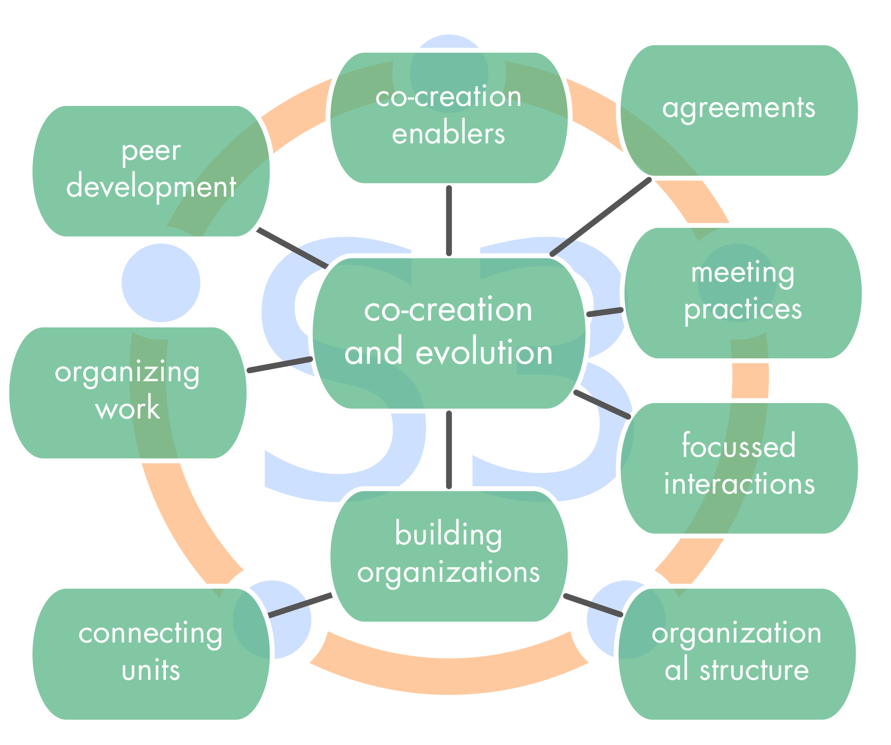

---

---

## P1.1: Driver

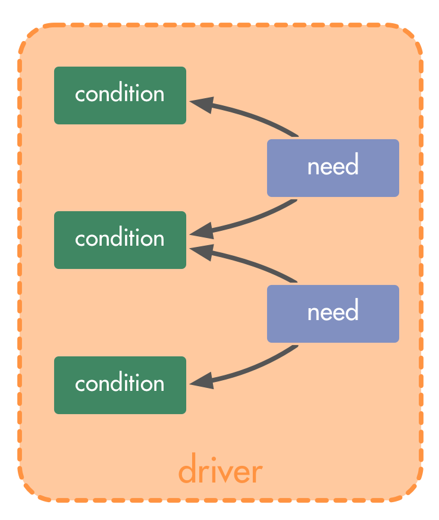

* **shared understanding** of our motivation for action (the "why")
* describes a **specific situation**: conditions and the **needs** we associate with it
* focus on the **present**, not future or assumptions
* precedes goals, objectives, aims, mission, vision, purpose
* drivers can change

The response to a driver is usually an experiment that evolves over time with what is learned.

---

## Review of Drivers: ###

* Is the description of the situation still correct?
* Do we still associate the same needs with the situation?
* Is the driver still within our domain?
* Is the driver still relevant?

---

### Drivers: Value and Waste ###

_**Value** is the importance, worth or usefulness of something in relation to responding to a driver._

**Waste** _is anything not necessary for - or standing in the way of - effective response of a driver._

Adopting the concept of value and waste makes many tools and ideas from **lean production** and **lean software development** available to support organizations running on Sociocracy 3.0:

* value stream mapping
* various strategies for eliminating waste
* the Kanban Method

---

## P1.2: Objection

_An **objection** is a reason why doing something stands in the way of (more) effective response to a driver._

Objections:

* stop proposals from becoming agreements
* reveal information that can be used to improve proposals and existing agreements
* reveal both opportunities or impediments

---

## Objection (cont.)

It's the accountability of the individual to raise objections, and the accountability of the group to address them. 

Withholding objections could harm the aims of a group or organization.

Being able to raise objections at any time means that proposals only need to be *good enough for now, safe enough to try*

---

# Qualifying Objections

> How would doing this impede - or miss an opportunity to improve - flow of value to any organizational driver?

---

## Understanding Objections ##

## Some Helpful Questions

* Does the objection relate to this specific proposal or agreement?
* Does this objection reveal how a (proposed or existing) **agreement**...
    * ...jeopardizes the response to a driver?
    * ...is in conflict with the organization's values?
    * ...prevents or diminishes someone's contribution to responding to a driver?
    * ...can be improved right now?

---

# Concerns #

* are not objections
* are recorded in the logbook 
* are heard if there's time or they're considered important
* often contain wisdom 
* can inform ways to further evolve agreements (including evaluation criteria and frequency of evaluation)

---

## P1.3: Navigating Via Tension

### ...for identifying and accounting for organizational drivers.

**All members** bring awareness to what might help or harm the organization, and aim to account for drivers in an effective way. 

A **tension** is an personal experience: a symptom of dissonance between an individual's perception and their expectations (or preferences). 

**Challenges and opportinities** for an organizations are revealed as people become aware of tensions they are experiencing in relation to them.

Looking behind tensions by describing what's happening and what's needed, we can often **discover drivers**. Sometimes in our inquiry reveals misconceptions and the tension goes away.

**Organizational drivers** can then be passed to the appropriate domain to address.

---

## Navigating Via Tension (cont.)

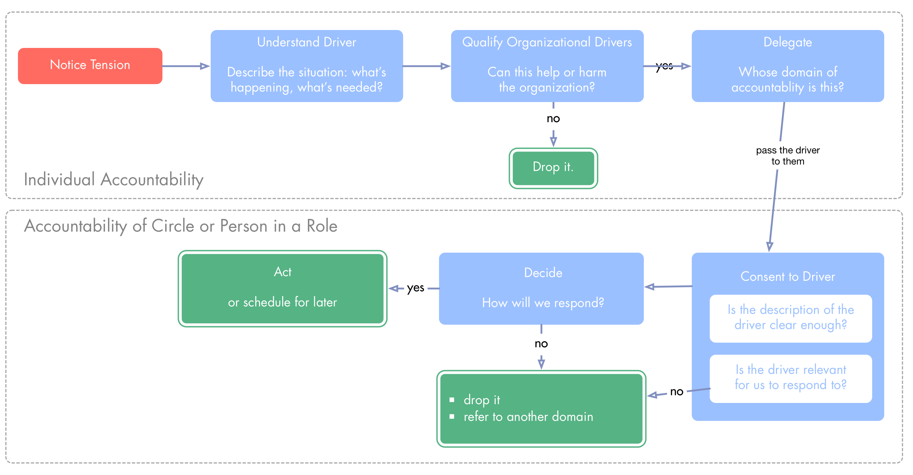

---

## P1.4: Qualifying Organizational Drivers

Some situations might be helpful to address in the context of an organizations primary driver, others are not within an organization's domain.

A simple way to qualifying organizational drivers is by checking:

_Would responding to this driver improve - or avoid impeding - flow of value to an existing Organizational Driver? a.k.a. can it help or harm us?_

---

## P1.5: Proposal Forming

Proposal Forming:

* is a (facilitated) format for co-creating a response to a drivers
* draws on the collective intelligence and diversity within a group
* taps the collective intelligence of a group
* involves people in co-creating agreements, fosters accountability and sense of ownership

---
  
## Proposal Forming Process ##

1. **Present and consent to driver**: _Is this driver relevant to respond to and a clear enough articulation of what's happening and what's needed_?
2. **Deepen shared understanding of driver**: invite essential questions to understand more detail about the driver
3. **Collect considerations** as questions that reveal the scope of the issue (information gathering questions and generative questions)
4. **Answer** information gathering questions
5. **Gather ideas** as ingredients for a proposal
6. **Design a proposal** for addressing the driver considering the creative ideas and information gathered so far (usually in a smaller group)
  
---

## Template for Proposals 

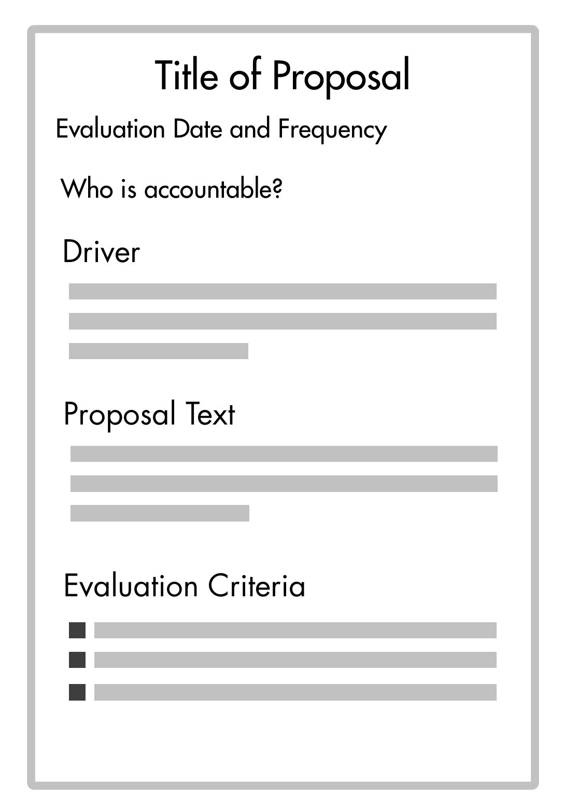

---

## P1.6: Consent Decision Making

* facilitated decision making process
* invite objections and integrate the wisdom they contain to evolve proposals or existing agreements
* withholding objections could harm the aims of a group or organization
* unaddressed objections prevent proposals becoming agreements
* can you *live with it* until the review? ➤ proposals only need to be *good enough for now, safe enough to try*

---

## Implicit Contract of Consent

* in the absence of objections against an agreement I support following through on the agreement as good as possible
* I agree to share objections as I become aware of them.

---

## P1.7: Resolve Objections

---

* Resolve Objections:
    * Hear One Objection
    * Amend Proposal 
    * Collect Objections to Amendment
    * Resolve Objections to Amendment (Hear/Amend/Collect/Resolve)
    * Process Next Objections 

---

## P1.8: Those Affected Decide

To make decisions with the maximum amount of information on the subject, involve everyone who is affected by the decision.

For large groups, facilitate a process in several stages and create smaller groups who select delegates.

This also applies to review and evolution of decisions.

---

## P1.9: Role Selection

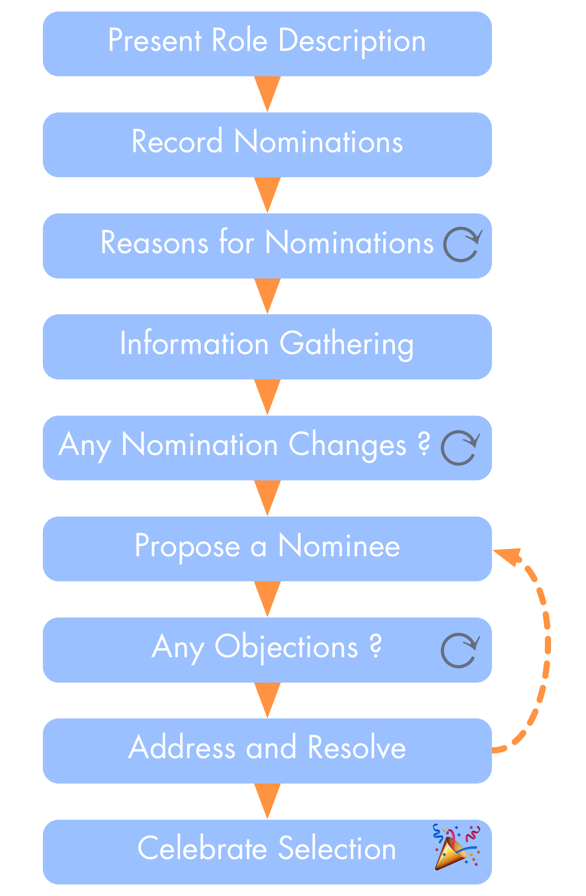

* People avoid expressing interest before elections 
* Nominations are made on the strength of the reason
    * not according to the majority
* You can nominate yourself or pass
* When harvesting objections, ask the candidate last
* Objections may be resolved by amending the role description or by nominating someone else

---

## P1.10: Driver Mapping

* a workshop format for identifying organizational structure (domain or  entire organization)
* based on *Impact Mapping* by Gojko Adzic, but focussed on flow of value and information, instead of actual deliverables
* alignment of organization to the pull of (external and internal) actors, e.g. customers, partners, members

---

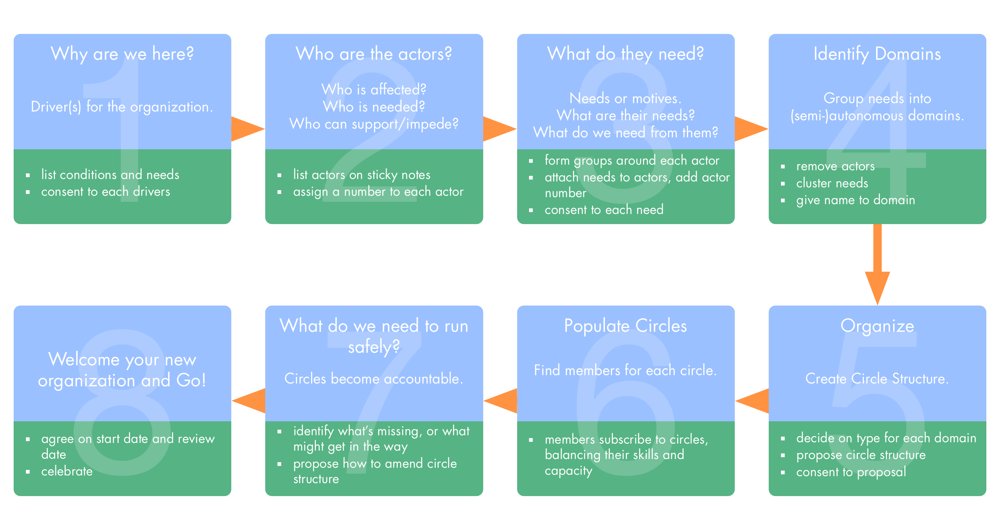

---

## Driver Mapping: Template for Domains 

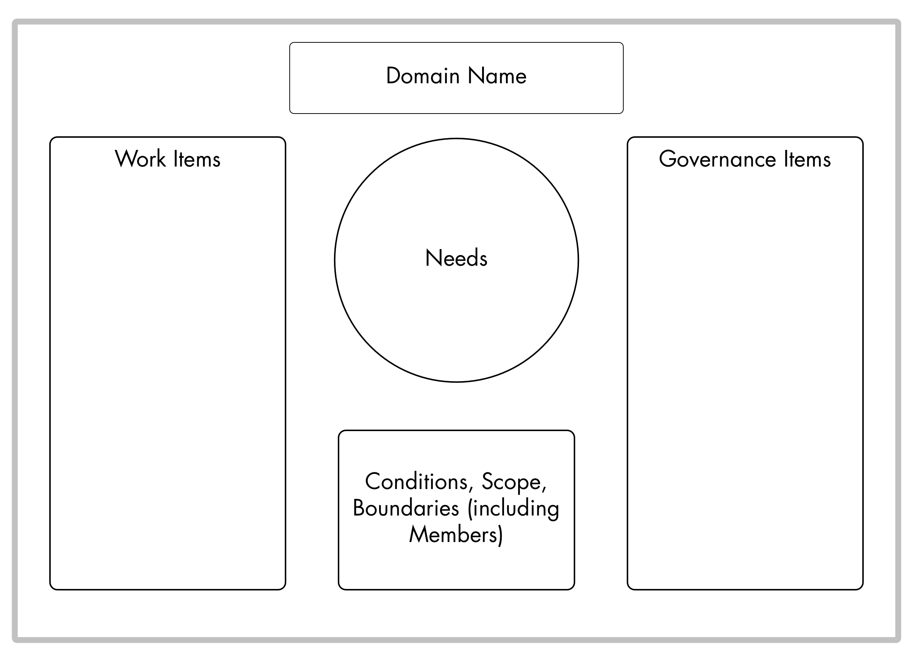

---

---

## Roles implement functions

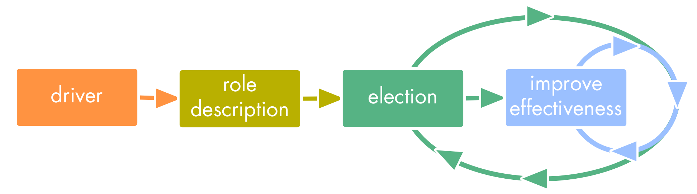

---

## Development Process ##

### Continuous improvement of the effectiveness of people in roles ###

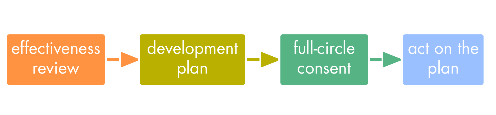

---

## P2.1: Ask For Help

---

## P2.2: Peer Feedback

---

## P2.3: Effectiveness Review

* development in roles supported by peers
* the individual holding the role initiates the process and begins each step
* harvest appreciations, identify opportunities for improvement and evolve the role

---

## Steps of an Effectiveness Review

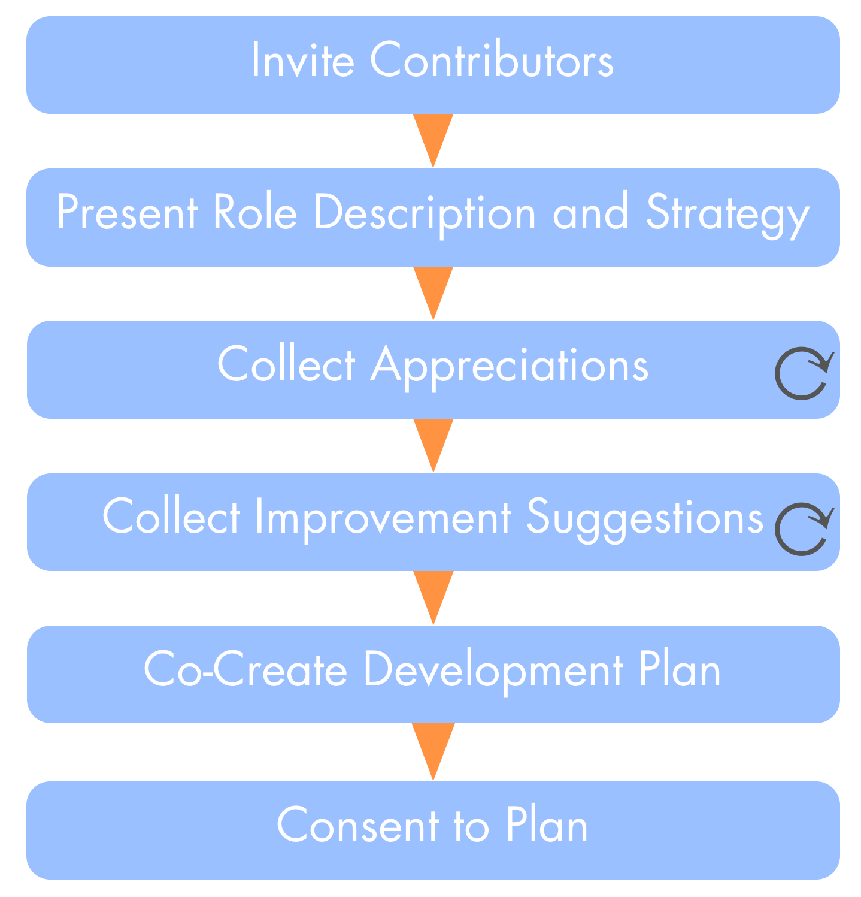

1. Invite people with complementing perspectives to contribute to the review, and a facilitator
2. Collect appreciations
3. Identify areas for improvement
    * personal development
    * updates to role description, function or driver 
4. Co-create and consent to a development plan

---

## P2.4: Development Plan

* an agreement for developing greater effectiveness in a role
* contents:
    - current role description
    - appreciations
    - areas for improvement
    - action items to improve effectiveness
    - evaluation criteria
    - suggested amendments to role description

---

## Template for Development Plan

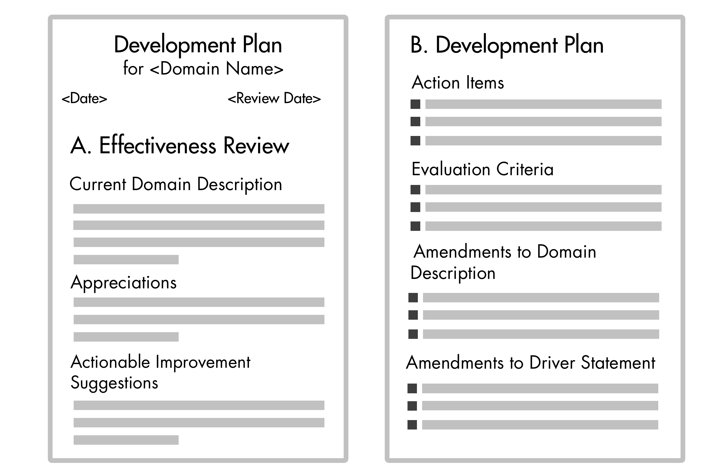

---

---

## P3.1: Artful Participation

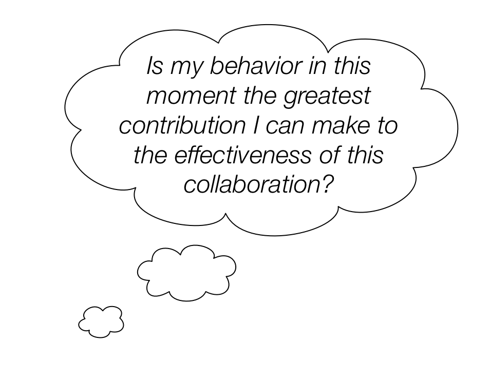

A commitment to developing helpful interactions and effective collaboration 

Participating artfully may include interrupting, objecting or breaking  agreements.

* enables **co-creation and evolution** of agreements
* is an **individual choice**, and powerful when embraced by many
* building self-accountability and integrity develops **trust**
* indivduals devloping collaboration skills makes for **stronger teams**
* culture of mutual support and close collaboration makes for **happier people**

---

## Artful participation (cont.)

An **individual commitment** to…

* actively **consider and follow-up on all agreements** made, in the best way possible, given the circumstances
* consciously **balance personal needs with those of a team** and organization as a whole 
* **developing the necessary skills** to do so
* **supporting others** in doing the same 
* bringing impediments to the attention of the circle if necessary

---

### Artful Participation: Self-Assessment

* How will I support myself and others in participating more artfully? 
* Where are my interactions with others unhelpful or ineffective?
* Which agreements do I find hard to keep or contribute to? What can I do to address this?
* What are skills that would support me to participate more artfully?
* What would artful participation mean in relation to...
    * ... my daily activities 
    * ...collaboration and interaction with others?
    * ...the organization? ...our customers or clients?
    * ...the wider environment?

---

## P3.2: S3 Facilitator (Role)

The facilitator supports the circle in developing their interactions and is responsible for making sure all meetings and workshops are facilitated and evaluated, e.g.

* governance meeting
* retrospectives
* daily standups 
* planning and review or coordination meeting

Often the actual facilitation is shared between several circle members.

---

## S3 Facilitator (cont.)

The facilitator should make themselves familiar with the following formats:

* rounds
* proposal forming
* consent decision making
* selections to roles
* meeting evaluation
* resolving objections

---

## P3.3: Be The Change

* be the change you want to create
* tell the story how you discovered S3
* invite others for experiments
* learn and grow (together)

---

## P3.4: Adopt The Seven Principles

---

## Adopt The Seven Principles (cont.)

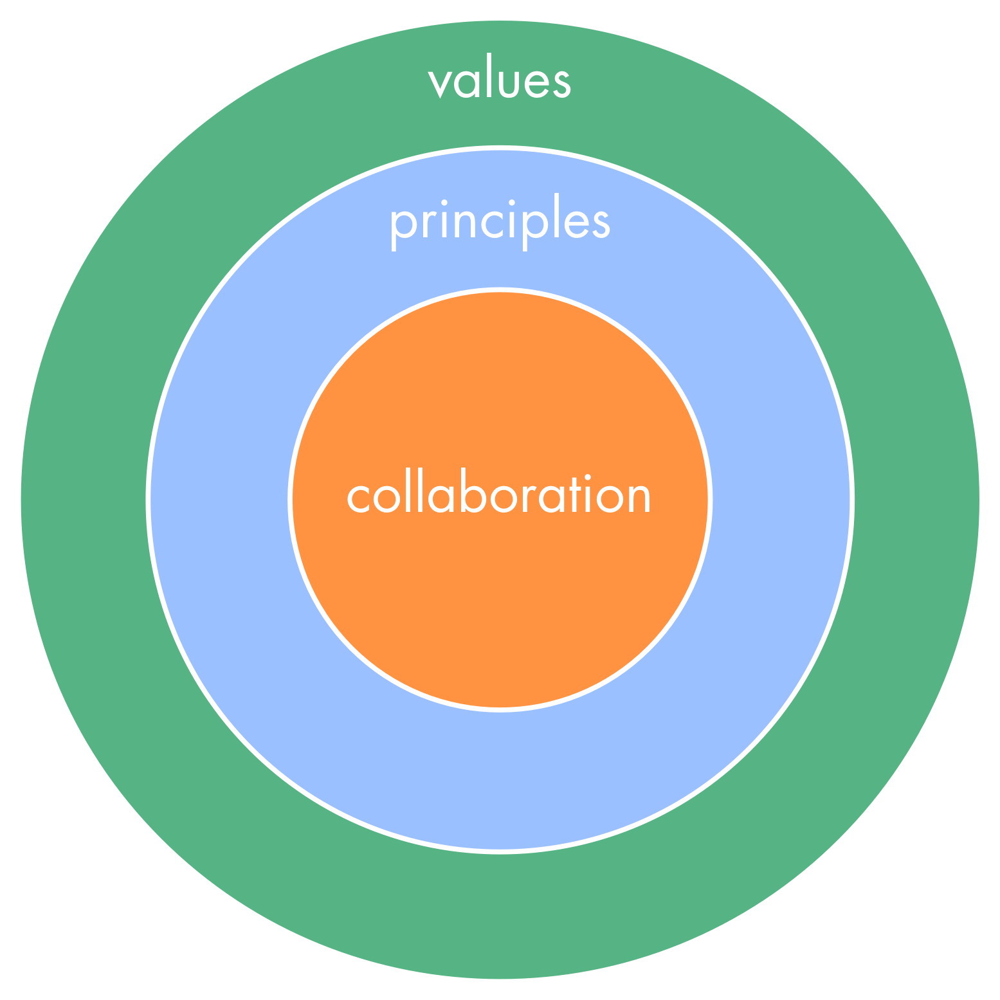

* values embrace Sociocracy 3.0 principles
* collaboration follows principles and values
* adopt the seven principles to reduce the number of agreements necessary, and to guide adaptation of patterns

---

## P3.5: Agree On Values

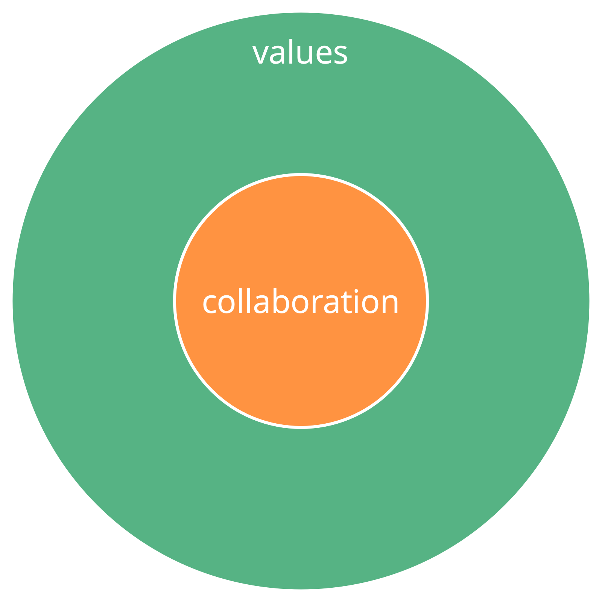

_A **value** is a principle of some significance that guides behavior._

* In an organization people come together to collaborate
* every individual has values that are influenced by their experiences and beliefs
* values may define ethical limitations to action

--- 

## Agree On Values (cont.)

* organizational values **define culture** and set parameters for action
* values offer guidance to determine appropriate action, even in the absence of explicit agreements
* a group or organization may **choose to collectively adopt values**
* defining values is a **strategy** that supports effectiveness of an organization:
    * reduces potential for **misunderstanding**
    * **aligns** decision making and action
    * **attracts new members, partners and customers** who are aligned with the organization
* values are an agreement, and thus subject to **regular reviews**

---

## P3.6: Adapt Patterns To Context

* adapting and evolving s3 patterns is a hypothesis-driven process
* **shared understanding and buy-in is essential**: make sure everyone affected by adaptation is present or represented when creating and evolving the adaptation
* make sure you understand *why* you need to adapt the pattern
* use S3 principles as guide for adaptation
* make sure experiment with adaptation runs long enough to provide enough experience
* consider feeding back successful adaptations to the S3 community

---

## P3.7: Support Roles

### Apply roles to external contractors ###
    
* identify function
* create a role description
* implement a selection process
* limit term of the contract
* initiate development process 

Support roles may be operational only, external contractors opt-in to role descriptions.

---

## P3.8: Bylaws

Secure S3 principles and patterns in your bylaws as needed, to protect **legal integrity** and **organizational culture**:
    
* consent decision making
* selection process for leadership roles
* governance structure
* influence of owners or shareholders

---

## P3.9: Transparent Salary

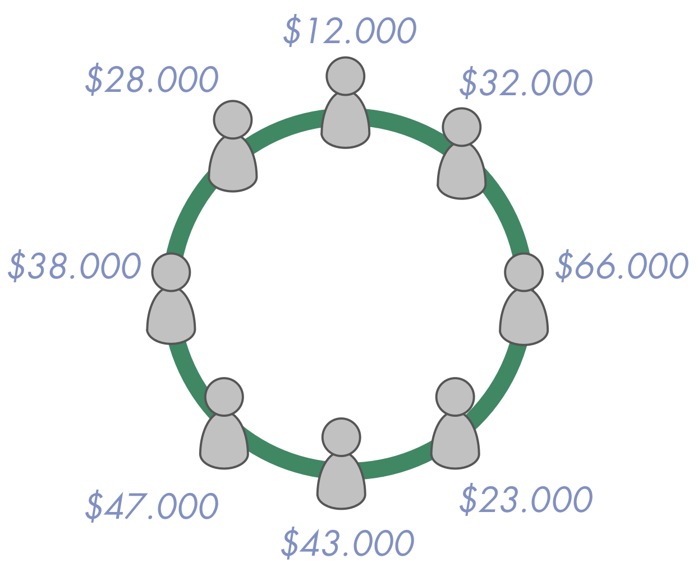

* transparent salaries need to be fair
* fairness has several orthogonal dimensions    
* perception of fairness is specific to organization
* consider members and relevant stakeholders (e.g. investors)
* fixed: subsistence guarantee
* variable: fair distribution of gains and losses
* consider remuneration for changing roles
* create strategy for transitioning towards new contracts and compensation agreements

---

## P3.10: Breaking Agreements

* is sometimes **necessary**...
* ...but may come at a **cost** to the community
* we are accountable:
    * **clean up** disturbances
    * **follow up** ASAP with those affected or accountable
    * **initiate changes** instead of breaking the rules repeatedly

---

## P3.11: Contracting And Accountability

To protect organizational culture, help new members have a smooth start, and provide for painless development of organizational structure, an organization needs to:

- develop a consent-based process for entering the organization that tests for both cultural fit and the skills required
- align contracts with both organizational culture and legal requirements
- define a default role for a new member
- define a process for leaving an organization
- provide a way for entering and leaving a circle

---

## P3.12: Pull-System For Organizational Change

* all change is voluntary
* create an environment that empowers and invites members of the organization to drive change
* bring in patterns that solve current and important problems
    * don't break what's already working
    * meet everyone where they are …
    * …and let them choose their own pace

---

## P3.13: Open S3 Adoption

* install a regular cadence of Open Spaces 
    * invite all members to create and run experiments
    * set boundaries for experiments: S3 principles
    * review experiments in the next Open Space
    * repeat

---

---

## S3 promotes a hypothesis-driven approach to decision making

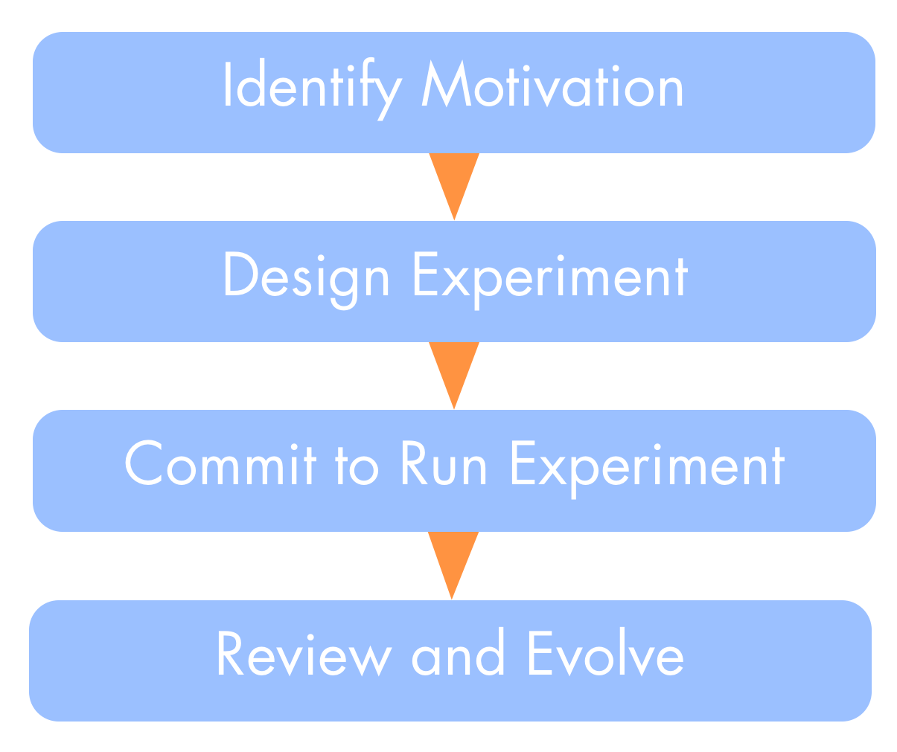

---

## Agreement Life-Cycle

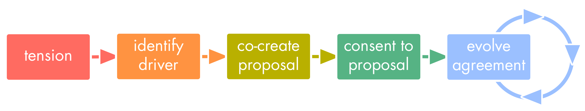

---

## P4.1: Strategy

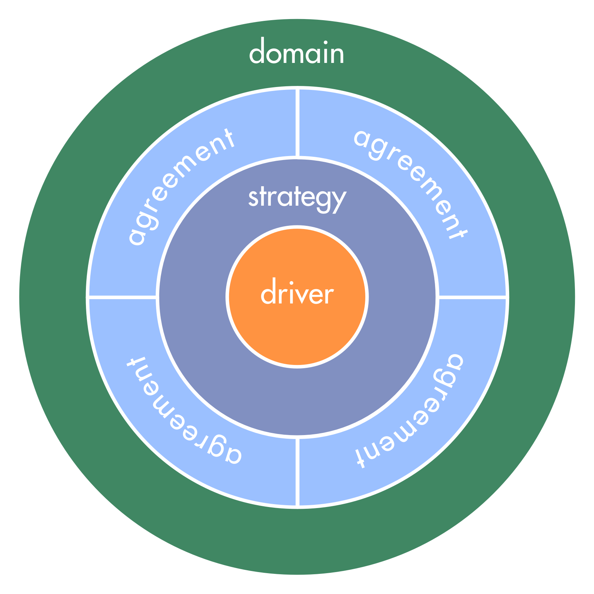

_A **strategy** is a high level approach towards creating value within a domain._

* an organization, circle or a person in a role can have their own strategy
* not a detailed plan or a full product description
* often includes a description of the intended outcome (a.k.a. "vision")
* is regularly reviewed and updated as necessary
* helps in the decision whether to continue or change course (*pivot or persevere*)

---

## Strategy (cont.)

### Strategies are implemented and refined through experimentation and learning. 

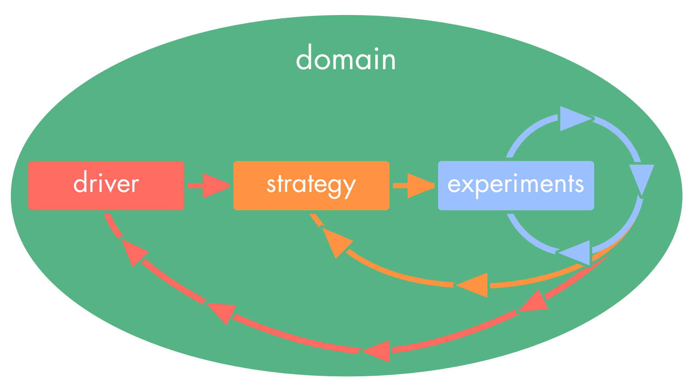

---

## P4.2: Agreements

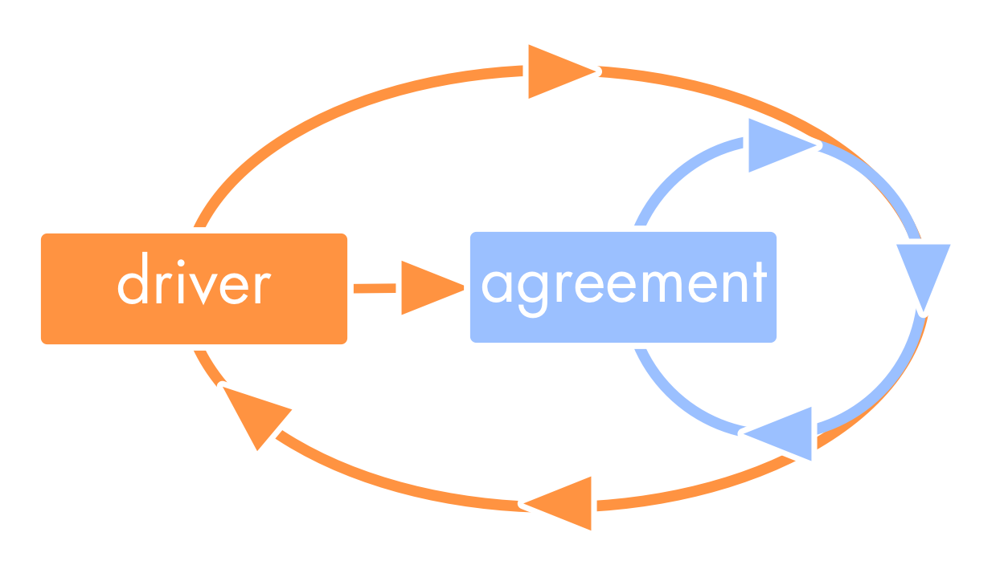

_An **agreement** is an agreed upon guideline, process or protocol designed to guide the flow of value._

* agreements are created in response to drivers 
* agreements are the **accountability of the people** that make them
* agreements are **regularily reviewed**

---

## Template for Agreements

---

## P4.3: Logbook

A logbook is a (digital) system to store all information relevant for the running an organizations or circle. The logbook is accessible to all members of an organization, information is hidden only when there is a good reason to do so.

Common platforms for logbooks are Wikis (e.g. Dokuwiki or MediaWiki, Content Management Systems (e.g. Wordpress), or Google Drive, Evernote or Trello.

---

## Logbook Contents

* Organization: 
    * driver, strategy
    * organizational values
    * organizational structure
    * agreements 

* Circle: 
    * driver, strategy
    * agreements
    * role definitions and role improvement plans

---

## Logbook Contents (cont.)

* Personal logbooks
    * role descriptions
    * tasks
    * personal strategy and personal policy

---

## P4.4: Logbook Keeper (Role)

The logbook keeper is responsible for maintaining a circle's logbook:

* recording all relevant information and adding it to the logbook
    * all agreements, role descriptions, selections etc.
    * making sure minutes of meetings are recorded and approved by participants
* keeping the logbook is up do date
* continuously improve organization of the logbook
* making the logbook and accessible to everyone in the circle (and in the wide organization as agreed)
* tending to all technical aspects of logbook keeping

---

## P4.5: Intended Outcome

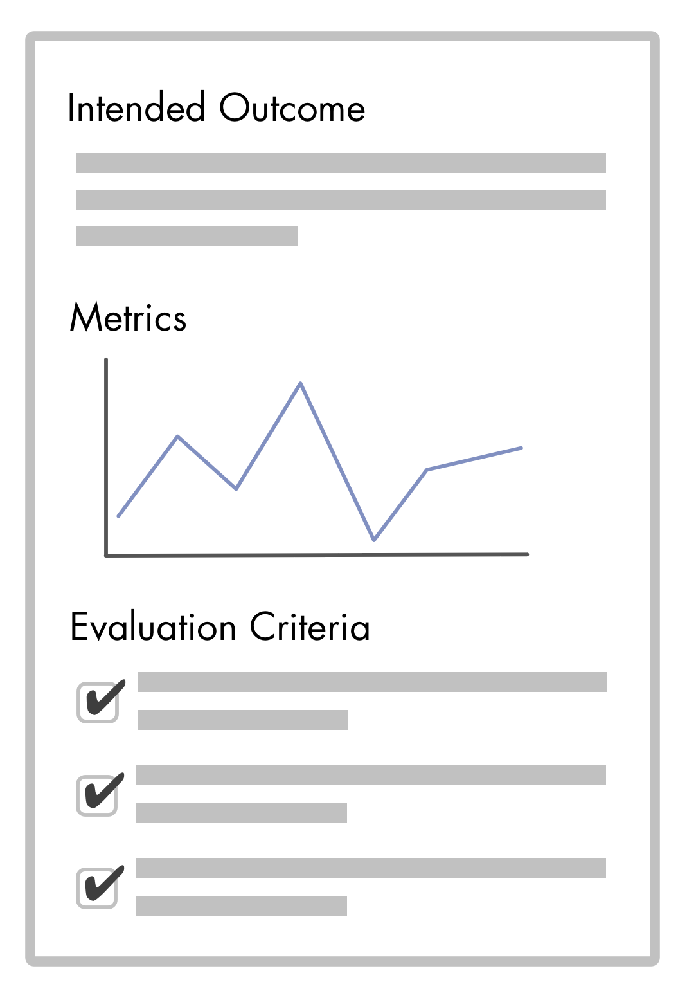

* brief description of the expected effects of an agreement (or strategy)
* specific *Evaluation Criteria* and metrics can be helpful for reviewing outcome

---

## P4.6: Describing Deliverables

A **deliverable** is something which is provided as a result of an agreement, usually framed as a product, a service.

**In the context of an agreement, clearly describing deliverables supports shared understanding**

* include reasonable amount of detail
* reference other documents when helpful or necessary

---

## Deliverables (cont.)

Explicitly defining deliverables can be useful for improving: 

* organizational strategy
* circle strategy
* development plans
* role descriptions
* any other agreement (e.g. business goals, process policy)

---

## P4.7: Evaluation Criteria

Evaluation criteria help you understand whether or not an agreement has the desired effect. 

* go for **simple and unambiguous** criteria and document them (avoids discussing opinions when reviewing your agreements)
* define **actionable metrics**, to continuously track effects and spot deviations from your intended outcome

---

## P4.8: Role Description

* manage expectations for roles
* role descriptions can be created using proposal forming 
* a minimal role description contains:
    * driver
    * term
    * key responsibilities
    * time requirements
    * resources, budget, privileges
    * preferable skills, experience and qualities
    * cadence of effectiveness reviews

---

## Template for Role Descriptions

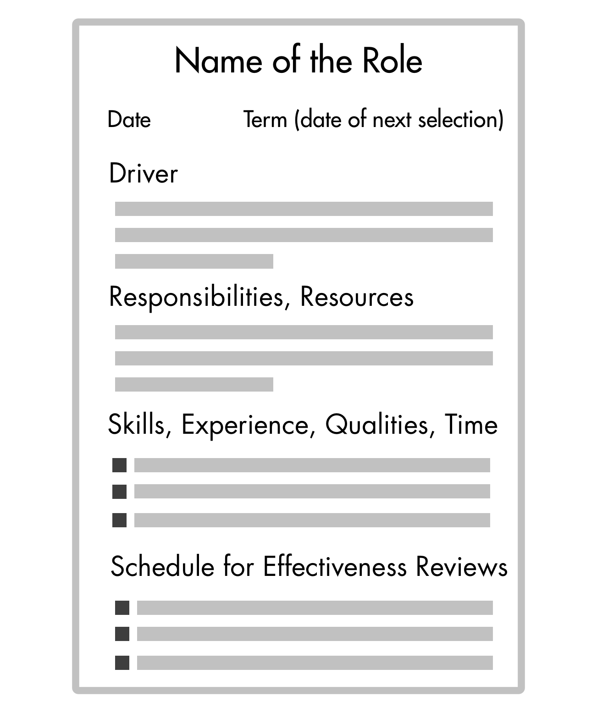

---

## P4.9: Evaluate Agreements

Regular review of agreements is an essential practice for a learning organization: continuously evolving the body of agreements, and eliminating waste:

* adapt to changing context
* integrate learning

*Is the agreement still relevant?*

*Is the agreement still good enough for now and safe enough to continue?*

*Is there a reason why NOT to continue with this agreement?*

---

## Evaluate Agreements (cont.)

* preparation
    * schedule review
    * ensure necessary information is available

* follow-up
    * agree on next review date
    * documentation / notification
    * tracking tasks and decisions
    * effects on related agreements

---

## Evaluate Agreements (cont.)

* evaluating agreements can be as simple as checking there's no objections to the agreemens as is
* review often takes place in *Governance Meetings* 
* sometimes it's effective to schedule a dedicated session for reviewing an agreement 
* adjust review frequency as necessary
* review earlier if required

---

---

## P5.1: Governance Meeting

Groups of people meet at regular intervals to create and evolve agreements relating to matters they are accountable for.

A governance meeting is usually:

* facilitated 
* prepared in advance 
* time-boxed for a duration of 90-120 minutes
* scheduled every 4 weeks

---

## A typical Governance Meeting structure includes: 

* **Opening Round**: attune with each other and to the purpose of the group
* Administrative Matters 
    * consent to last minutes, dates, 
    * check for last-minute agenda items and consent to agenda
* Agenda Items 
    * any short reports 
    * evaluation of existing agreements due review
    * new matters requiring decisions to be made, including: 
        * understanding and agreeing on situations that require attention 
        * forming proposals and making agreements 
        * creating and defining new roles and teams 
        * reviewing existing roles and teams 
        * selecting people to roles 
* Closing: evaluation of the meeting process and acknowledge achievements and any challenges encountered and addressed

---

## P5.2: Retrospective

**Building in continuous improvement of process**

* goal: reflection on the past to guide process improvement
* output: proposals for agreements, tensions, drivers or tasks
* facilitated meeting (~1hr)
* regular intervals (1-4 weeks)
* adapt to situation and context: 
    * 5 phases with many different patterns for each phase 

---

## Retrospective: A time to reflect on process improvement ##

---

## Five Phases of a Retrospective Meeting ##

1. Set the Stage 
2. Gather Data
3. Generate Insights
4. Decide What to Do
5. Close the Retrospective

Activities for each phase can be found at [plans-for-retrospectives.com](http://www.plans-for-retrospectives.com/)

---

## P5.3: Daily Standup

**Speed up learning and improvement.**

* ~15 min
* every day at the same time
* circle gathers around the task board
* coordination of daily work
* adaptation of existing agreements or creation of new agreements on the spot

---

## P5.4: Planning And Review Meetings

* planning and review happen at regular intervals (1-4 weeks)
* planning meeting: 
    - select and estimate work items for iteration
* review meeting: 
    - review finished work items
    - decide on re-work and changes for next iteration

---

## P5.5: Coordination Meeting

Meet on a regular basis (usually weekly) for reporting on and coordinating work.

* facilitate the meeting, use rounds instead of discussions
* Status Reports: 
    * circle metrics (if any)
    * projects and tasks
* Agenda Items: 
    * sharing of information
    * add or update tasks or projects
    * propose new or updated agreements
* if possible agenda items are compiled before the meeting (some items will come up during the status reports)

---

---

## P6.1: Rounds

 

A group facilitation technique to maintain equivalence.

1. Pick a random person to start
    * begin with a different person each time to maintain equivalence
2. Go around the circle, giivng everyone the chance to speak

There are a number of ways that experienced groups can fast track certain rounds.

---

## P6.2: Meeting Facilitation

Choose someone to facilitate a meeting. Even an inexperienced facilitator makes a difference.

* prepare an agenda of topics
* select a facilitator who
    * picks an activity or format for each topic that fits the topic and the number of participants
    * holds the space, keeps the time and navigates the agenda during the meeting
    * evaluates the meeting at the end

---

## P6.3: Meeting Evaluation

At the end of each meeting or workshop, take the time to evaluate your interactions and learn what can be improved.

* before the closing round
* reserve 5 minutes for 1 hour, and 15 minutes for a full-day workshop
* record the results in the logbook
* proposals for improvements are implemented by facilitator and meeting host, or added to the governance backlog
* short formats: 
    * more of/less of/start/stop/keep
    * positive/negative/suggested improvements

---

## Meeting Evaluation: Long Format

Ask everyone in a round to briefly contribute to any or all of the following topics: 

* effectiveness
* facilitation and format
* emotional tone
* I liked... (acknowledgments and achievements)
* I wish... (growing edges and improvements)
* What if... (wild ideas and radical suggestions)

---

## P6.4: Meeting Host (Role)

The meeting host is accountable for proper preparation and follow-up of meetings, workshops or other events. 

The role may be assigned temporarily (i.e. for one specific event) or permanently. e.g. for all events of one circle.

---

## Meeting Host: Responsibilities

* preparation
    - identify goals and deliverables
    - select facilitator and keeper of the minutes
    - prepare and distribute agenda and schedule
    - estimate required time
    - identify and invite participants
    - schedule the meeting/workshop
    - book location (and transportation if required)
    - set up the space, provide required materials and information
* follow-up
    - clean up location, return keys etc.
    - make sure minutes are distributed and approved
    

---

## P6.5: Governance Backlog

The governance backlog is a prioritized list of items (drivers) that require or may benefit from a group decision.

* decisions to make
* proposals to create and consider
* agreements for review
* selecting people for roles
* upcoming effectiveness reviews

---

---

## P7.1: Visualize Work

* transparency about the state of all work items currently in planning, in progress or completed.
* essential for self-organization and pull-systems
* system must be accessible to everyone affected
* **analog**: post-its on a wall, or index cards, magnets and white board
* **digital**: Google Sheets, Trello, Kanbanery, Leankit, Google Sheets, etc.

---

## Things to track: 

* **types of work items** (e.g. customer request, project tasks, reporting tasks, rework)
* **start date** and optionally **due date**
* **priorities**
* **stages** of work (e.g. "to do", "in progress", "review" and "done")
* blocks
* who is working on which items
* agreements and expectations guiding workflow (e.g. definition of done, policy, quality standards)
* use colors, symbols, highlights etc.

---

## P7.2: Operations Backlog

---

## P7.3: Prioritized Backlog

A prioritized backlog is an **ordered a list of all uncompleted work items**, with the **most important items on top**. 

Work items are pulled from the top whenever there's new capacity.

No two items can be of equal importance, it's 
essential to agree on priorities and make tough choices.

---

## Prioritized Backlog (cont.)

* **Benefits**
    - focus in most important items
    - keep track of everything
    - just-in-time specification, reduced cost of change
    - shared understanding of priorities enables more effective collaboration
* **Implementation**
    - **analog backlog**: sticky notes on a wall, or index cards, magnets and whiteboard
    - **digital backlog**: e.g. Google Sheets, Trello

---

## Elements of a prioritized backlog 

* a **unique reference number** (or ling) for each work item
* a **title or short description**
* the **order of work items**
* **dependencies**
* **due dates** (does not apply to all items)
* (optional) a measure for **value** 
* (optional) a measure for **investment** (often an estimate of time or complexity)

---

## P7.4: Pull-System For Work

* people pull in new items when they have capacity (instead of work being pushed at them)
* priorize available work items to get make sure important items get worked on first
* prevents overloading the system, especially when amount of work in progress (WIP) per person is limited 

---

## P7.5: Limit Work in Progress

---

## P7.6: Continuous Improvement Of Work Process

### To reveal tensions and establish a metrics-based pull-system for organizational change.

* start with consent in one circle, elect a facilitator, define values, and go
* trigger continuous improvement (e.g through Kanban)
* let them pull in patterns 
* then expand the scope of the experiment

---

## Waste and Continuous Improvement

**Waste** _is anything not necessary for - or standing in the way of - effective response to a driver._

* waste exists in many different forms and on different levels of abstraction (tasks, processes, organizational structure, mental models...)
* establishing a process for ongoing elimination of waste enables natural evolution of an organization towards greater effectiveness
* adaptation to changing environment is built into the process

---

## P7.7: Align Flow

* in an effective organization, the **flow of information and influence supports the continuous flow of value**
* alignment is achieved and maintained through continuous improvement of agreements

---

### Flow of Value ###

* flow of value is guided by agreements (explicit and implicit), and assumptions
* work in progress is considered waste as it ties up resources
* continuous flow of value prevents accumulation of waste
    * it also makes for shorter feedback loops and amplifies learning

---

## P7.8: Coordinator (Role)

The coordinator is accountable for **coordinating a circle's
collaboration**, and is **selected by the circle for a limited term.**

Responsibilities:

- project management
- task assignment
- stewarding delveopment of the circle
- supporting circle members in
    - keeping agreements
    - personal development
    - developing artful participation
    - understanding S3 principles and patterns

---

---

## Building Organizations

Patterns for growing an organization along the principles behind S3. 

In the addition to the patterns in this sections there's also two subsections: 

* People and Roles
* Organizational Structure.

---

## P8.1: Domain

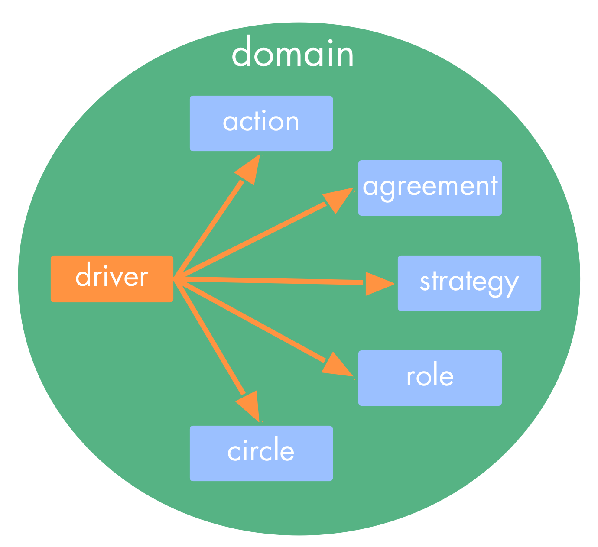

_A **domain** is an area of influence, autonomy and accountability._

Building an organization from domains defined along organizational drivers facilitates effective collaboration by creating enabling constraints and clear and logical boundaries for accountablility.

When defining a domain in relation to an organisational driver, consider  
responsibilities, the resources and skills required, and the constraints to the domain's autonomy necessary for collaboration and exchange with other domains. 

---

## Domains and Accountability

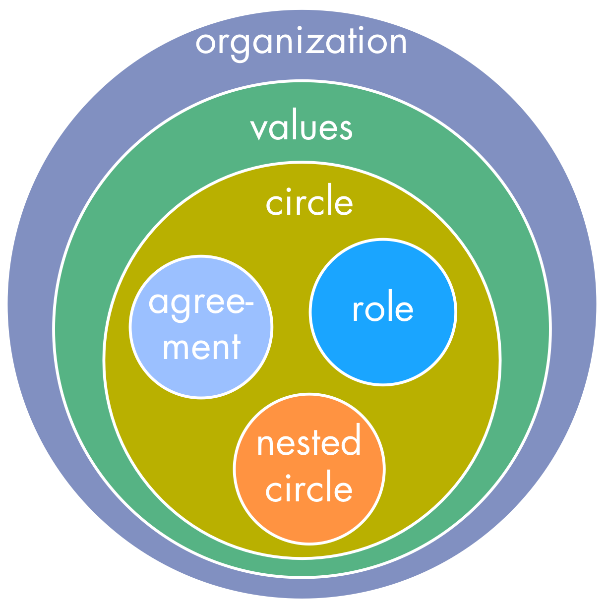

* accountability applies to all agreements, including the organization itself, circles, and roles
* everyone's primary accountability is for effective collaboration in response to drivers
* circles are accountable their work, for their body of agreements and for their own development
* everyone in an organization is accountable for upholding organizational values and principles

---

## P8.2: Circle

  

_A **circle** is a semi-autonomous and often self-governing group of people collaborating to respond to a driver._

A circle:

* may be permanent or temporary
* is accountable for its own development

---

## Circle (cont.)

* **semi-autonomous**: 
    * a circle acts within the constraints of the surrounding organization
    * each circle responds to a primary driver, can create value independently, and organizes day-to-day-work
* **self-governing**:
    * independent in creating strategy and agreements

---

## P8.3: Role

* roles are more flexible than positions
* people can wear many hats
* (s)election by consent…
* …and for a limited term
* peers support development in roles

---

## P8.4: Nested Domains

---

---

## P9.1: Linking

**Connecting two circles**

* two circles each select a delegate to the other circle
* delegates represent their parent circles in important decisions and take part in governance meetings

---

## P9.2: Double Linking

### Facilitate two-way flow of information and influence

* Two interdependent circles each elect a representative to participate as full members in both circles' governance meetings
* can be used to prevent tensions in hierarchical structures

---

## P9.3: Representative

Representatives (a.k.a Links)...:

* ...stand for the interests of one circle in another circle
* ...are elected for a limited term
* ...participate as full members in governance meetings of the other circle and can:
    * raise items for the agenda
    * object to agreements and proposals

---

---

## Organizational Structure ##

* enables effective collaboration
* delegates decision making power
* evolves continuously to adapt to changing environments

**Semi-autonomous, self-organizing and self-governing circles** are the basic building blocks for organizational structure.

Circles can be linked in a hierarchy or a **heterarchy** (a.k.a. complex adaptive system, or network), where different functional structures co-exist.

---

## Structural Patterns ##

* Sociocracy 3.0 describes a variety of patterns to grow organizational structure
* patterns apply to different layers of abstraction (basic, micro, macro and meta)
* different patterns serve different drivers
* patterns can be combined as needed
* more patterns are out there and will be discovered

---

## P10.1: Delegate Circle

### A pattern for coordination 

---

## P10.2: Service Circle

### A pattern for outsourcing shared services

---

## P10.3: Helping Circle

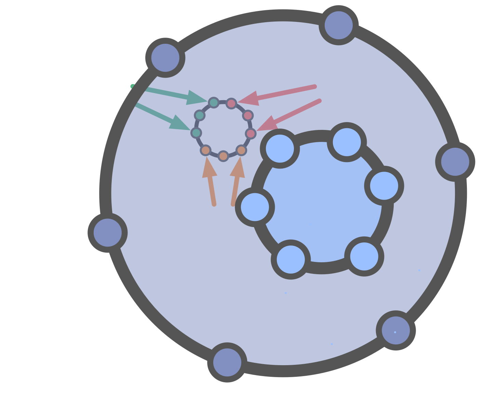

A group of people with the mandate to execute on rules and guidelines set by its parent circle.

* expands capacity of the parent circle 
* self-organizing or guided by coordinator/leader. 
* has no governance meeting
* can raise objections to rules and guidelines to parent circle.

---

## P10.4: Coordination Circle

A coordination circle coordinates decision making and collaboration of several circles.

Coordination circles may be accountable for all aspects of collaboration, or just for a specific subset (or subdomain).

---

## P10.5: Peach Organization

### Periphery drives the organization, the center provides services.

---

## P10.6: Double-Linked Hierarchy

### A pattern for the early phase of a transformation

---

## P10.7: Backbone Organization

### A pattern for multi-stakeholder projects or services.

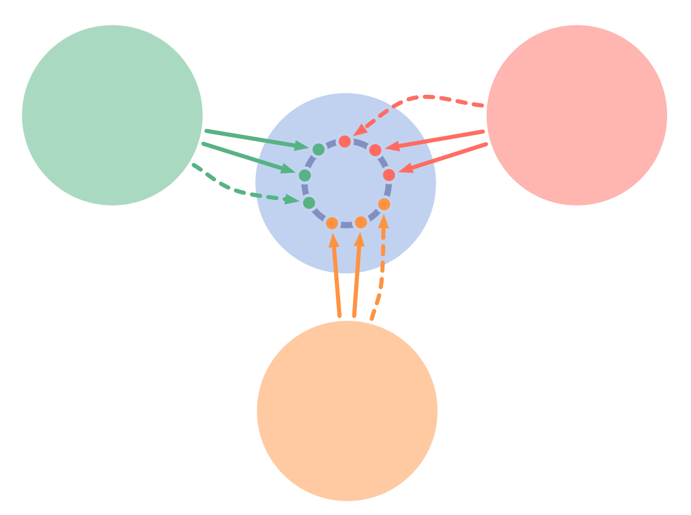

---

## P10.8: Fractal Organization

### A Pattern for learning, coordination and alignment across organizational boundaries.

---

## P10.9: Open Systems

An organization is not a closed system, it is an open network with many connections to the "outside".

Keep the system open by adding connections as temporary or permanent members in decision making and experiments:

* external experts: benefit from outside perspective and knowledge
* representatives of affected parties: integrate existing relationships ( ➤ Those Affected Decide)

---

## Links #

**S3 website**: [http://sociocracy30.org](http://sociocracy30.org)

More resources on Bernhard's website:
<http://evolvingcollaboration.com/sociocracy-30>

Follow us on **twitter**: [@sociocracy30](http://twitter.com/@sociocracy30)

---

# License #

This work by Bernhard Bockelbrink and James Priest is licensed under the Creative Commons Attribution-ShareAlike 4.0 International License. To view a copy of this license, visit [http://creativecommons.org/licenses/by-sa/4.0/](http://creativecommons.org/licenses/by-sa/4.0/).

The latest version of this document is available at <http://evolvingcollaboration.com/sociocracy-30>

---

**Bernhard Bockelbrink** is an agile coach, trainer and consultant supporting individuals, teams and organizations in navigating complex challenges and developing a culture of effective, conscious and joyful collaboration.

[evolvingcollaboration.com](http://evolvingcollaboration.com) -- [bernhard.bockelbrink@gmail.com](mailto:bernhard.bockelbrink@gmail.com)

**James Priest** is an interdependent consultant, facilitator and trainer specializing in holistic organizational development, distributed leadership implementation and complex systems optimization.

[thriveincollaboration.com](http://thriveincollaboration.com)  -- [james@thriveincollaboration.com](mailto:james@thriveincollaboration.com)

---

